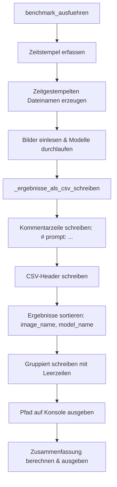

# Design-Dokument: Benchmark Prompt Tracking

## Übersicht

Dieses Design beschreibt drei gezielte Erweiterungen der bestehenden `BenchmarkRunner`-Klasse in `lightroom_ollama_keywords/benchmark_runner.py`:

1. **Prompt-Kommentarzeile**: Eine `# prompt: ...`-Zeile am Anfang der CSV-Datei, die den verwendeten Prompt festhält.
2. **Zeitgestempelte Dateinamen**: Statt die konfigurierte CSV-Datei zu überschreiben, wird ein Zeitstempel (`YYYYMMDD_HHMMSS`) in den Dateinamen eingefügt.
3. **Sortierte und gruppierte CSV-Ausgabe**: Zeilen werden nach Bildname gruppiert (mit Leerzeilen zwischen Gruppen) und innerhalb jeder Gruppe alphabetisch nach Modellname sortiert.

Alle Änderungen betreffen ausschließlich die Methoden `benchmark_ausfuehren` und `_ergebnisse_als_csv_schreiben` des bestehenden `BenchmarkRunner`. Es werden keine neuen Klassen, Dateien oder Abhängigkeiten eingeführt.

### Technologie-Entscheidungen

- **Zeitstempel**: `datetime.now().strftime("%Y%m%d_%H%M%S")` — Standardbibliothek, kein neues Dependency
- **Pfad-Manipulation**: `os.path.splitext` zum Aufspalten von Basisname und Extension — bereits im Modul verwendet
- **Sortierung**: Python `sorted()` mit Tupel-Key `(image_name, model_name)` — stabil und deterministisch

## Architektur

Die Architektur bleibt unverändert. Die Erweiterung betrifft nur den internen Ablauf innerhalb des `BenchmarkRunner`:



## Komponenten und Schnittstellen

### Geänderte Methode: `benchmark_ausfuehren`

Neue Schritte am Anfang der Methode:

1. Zeitstempel erfassen: `datetime.now().strftime("%Y%m%d_%H%M%S")`
2. Zeitgestempelten Dateinamen berechnen: `{basisname}_{zeitstempel}.csv`
3. Den berechneten Pfad anstelle des übergebenen `output_csv` verwenden
4. Nach dem Schreiben den vollständigen Pfad auf der Konsole ausgeben

```python
def benchmark_ausfuehren(self, image_dir: str, output_csv: str) -> list[BenchmarkZusammenfassung]:
    zeitstempel = datetime.now().strftime("%Y%m%d_%H%M%S")
    output_csv = self._zeitgestempelter_pfad(output_csv, zeitstempel)
    # ... bestehender Ablauf ...
    self._ergebnisse_als_csv_schreiben(ergebnisse, output_csv)
    print(f"Benchmark-Ergebnisse: {output_csv}")
    # ...
```

### Neue Hilfsmethode: `_zeitgestempelter_pfad`

```python
def _zeitgestempelter_pfad(self, output_csv: str, zeitstempel: str) -> str:
    """Erzeugt einen zeitgestempelten Dateinamen.
    
    Beispiel: './benchmark_results.csv' + '20250715_143022'
           -> './benchmark_results_20250715_143022.csv'
    """
    basis, ext = os.path.splitext(output_csv)
    return f"{basis}_{zeitstempel}{ext}"
```

### Geänderte Methode: `_ergebnisse_als_csv_schreiben`

Die Methode erhält einen zusätzlichen Parameter `prompt` und wird wie folgt erweitert:

```python
def _ergebnisse_als_csv_schreiben(
    self, ergebnisse: list[BenchmarkErgebnis], output_path: str, prompt: str
) -> None:
    """Schreibt Benchmark-Ergebnisse als CSV.
    
    1. Kommentarzeile mit Prompt (Zeilenumbrüche durch Leerzeichen ersetzt)
    2. CSV-Header
    3. Ergebnisse sortiert nach (image_name, model_name), gruppiert mit Leerzeilen
    """
    prompt_einzeilig = prompt.replace("\n", " ").replace("\r", " ")
    sortierte = sorted(ergebnisse, key=lambda e: (e.image_name, e.model_name))
    
    with open(output_path, "w", newline="", encoding="utf-8") as f:
        f.write(f"# prompt: {prompt_einzeilig}\n")
        writer = csv.writer(f)
        writer.writerow(["model", "image", "keywords", "response_time_ms"])
        
        letztes_bild = None
        for e in sortierte:
            if letztes_bild is not None and e.image_name != letztes_bild:
                f.write("\n")  # Leerzeile zwischen Bildgruppen
            writer.writerow([
                e.model_name,
                e.image_name,
                ";".join(e.keywords),
                e.response_time_ms,
            ])
            letztes_bild = e.image_name
```

### Aufruf-Anpassung in `benchmark_ausfuehren`

Der Aufruf ändert sich von:
```python
self._ergebnisse_als_csv_schreiben(ergebnisse, output_csv)
```
zu:
```python
self._ergebnisse_als_csv_schreiben(ergebnisse, output_csv, self.config.prompt_template)
```

## Datenmodelle

Keine neuen Datenmodelle. Die bestehenden `BenchmarkErgebnis`, `BenchmarkZusammenfassung` und `Config` bleiben unverändert.

### CSV-Ausgabeformat (erweitert)

```csv
# prompt: Analyze this photograph and provide descriptive keywords. Return ONLY a comma-separated list.
model,image,keywords,response_time_ms
gemma3,portrait_studio.jpg,portrait;woman;studio;lighting,987
moondream,portrait_studio.jpg,portrait;face;studio;professional,1100

gemma3,sunset_beach.jpg,coastal;sunset;landscape;nature,1890
llava:7b,sunset_beach.jpg,sunset;beach;sand;water;sky;warm colors,2567
moondream,sunset_beach.jpg,sunset;beach;ocean;golden hour;waves,1234
```

- Zeile 1: Kommentarzeile mit `# prompt: ` Präfix, einzeilig
- Zeile 2: CSV-Header (unverändert)
- Zeilen 3+: Ergebnisse sortiert nach `image_name`, dann `model_name`
- Leerzeilen zwischen Bildgruppen

### Zeitgestempelter Dateiname

| Konfigurierter Pfad | Zeitstempel | Erzeugter Pfad |
|---------------------|-------------|----------------|
| `./benchmark_results.csv` | `20250715_143022` | `./benchmark_results_20250715_143022.csv` |
| `./output/bench.csv` | `20250715_143022` | `./output/bench_20250715_143022.csv` |


## Correctness Properties

*Eine Property ist eine Eigenschaft oder ein Verhalten, das über alle gültigen Ausführungen eines Systems hinweg gelten sollte — im Wesentlichen eine formale Aussage darüber, was das System tun soll. Properties bilden die Brücke zwischen menschenlesbaren Spezifikationen und maschinenverifizierbaren Korrektheitsgarantien.*

### Property 1: Prompt-Kommentarzeile

*Für alle* Prompt-Strings (einschließlich solcher mit Zeilenumbrüchen `\n`, `\r`) und *für alle* Listen von BenchmarkErgebnis-Objekten: Die erste Zeile der erzeugten CSV-Datei soll mit `# prompt: ` beginnen, gefolgt vom vollständigen Prompt-Text, wobei alle Zeilenumbrüche durch Leerzeichen ersetzt sind. Die Kommentarzeile soll genau eine Zeile umfassen.

**Validates: Requirements 1.1, 1.2, 1.3**

### Property 2: CSV-Daten-Round-Trip mit Prompt-Kommentar

*Für alle* Listen von BenchmarkErgebnis-Objekten und *für alle* Prompt-Strings: Wenn die Ergebnisse als CSV geschrieben und anschließend eingelesen werden (wobei die Kommentarzeile und Leerzeilen übersprungen werden), soll die Anzahl der Datenzeilen der Anzahl der Ergebnisse entsprechen, und für jeden Eintrag sollen Modellname, Bildname, Keywords und Antwortzeit übereinstimmen.

**Validates: Requirements 1.4, 3.4**

### Property 3: Zeitgestempelter Dateiname

*Für alle* CSV-Basispfade (mit `.csv`-Endung) und *für alle* gültigen Zeitstempel-Strings im Format `YYYYMMDD_HHMMSS`: Der erzeugte Dateiname soll dem Muster `{basisname}_{zeitstempel}.csv` entsprechen, wobei `{basisname}` der Pfad ohne `.csv`-Endung ist.

**Validates: Requirements 2.1, 2.2**

### Property 4: Sortierung nach Bild und Modell

*Für alle* nicht-leeren Listen von BenchmarkErgebnis-Objekten: Die Datenzeilen in der erzeugten CSV-Datei sollen nach `(image_name, model_name)` aufsteigend sortiert sein.

**Validates: Requirements 3.1, 3.2**

### Property 5: Leerzeilen zwischen Bildgruppen

*Für alle* Listen von BenchmarkErgebnis-Objekten mit mindestens zwei verschiedenen Bildnamen: In der erzeugten CSV-Datei soll genau eine Leerzeile zwischen jeder Bildgruppe stehen, und innerhalb einer Bildgruppe sollen keine Leerzeilen vorkommen.

**Validates: Requirements 3.3**

## Fehlerbehandlung

Die Fehlerbehandlung bleibt gegenüber dem bestehenden Design unverändert. Die neuen Funktionen führen keine neuen Fehlerfälle ein:

| Situation | Verhalten |
|-----------|-----------|
| Prompt enthält Zeilenumbrüche | Werden durch Leerzeichen ersetzt — kein Fehler |
| Ausgabedatei existiert bereits | Wird überschrieben (bestehendes Verhalten von `open(..., "w")`) |
| Ausgabeverzeichnis existiert nicht | `FileNotFoundError` wird vom OS geworfen — bestehendes Verhalten |
| Leere Ergebnisliste | CSV wird mit Kommentarzeile und Header geschrieben, keine Datenzeilen — kein Fehler |

## Teststrategie

### Dualer Testansatz

Die Teststrategie kombiniert Property-basierte Tests und Unit-Tests.

#### Property-basierte Tests (pytest + Hypothesis)

- **Bibliothek**: [Hypothesis](https://hypothesis.readthedocs.io/)
- **Mindestens 100 Iterationen** pro Property-Test
- **Jeder Test referenziert** die zugehörige Design-Property
- **Tag-Format**: `Feature: benchmark-prompt-tracking, Property {nummer}: {text}`

| Property | Was wird getestet |
|----------|-------------------|
| Property 1 | Prompt-Kommentarzeile: Präfix, vollständiger Text, Zeilenumbruch-Ersetzung |
| Property 2 | CSV-Daten-Round-Trip: Datenzeilen nach Überspringen der Kommentarzeile und Leerzeilen |
| Property 3 | Zeitgestempelter Dateiname: Muster `{basis}_{YYYYMMDD_HHMMSS}.csv` |
| Property 4 | Sortierung: Zeilen nach `(image_name, model_name)` aufsteigend |
| Property 5 | Leerzeilen: Genau eine Leerzeile zwischen Bildgruppen, keine innerhalb |

#### Unit-Tests (pytest)

| Test | Was wird getestet | Anforderung |
|------|-------------------|-------------|
| Zeitstempel wird am Start erfasst | Mock `datetime.now`, prüfe Dateiname | 2.3 |
| CSV-Pfad auf Konsole | `capsys` prüft Konsolenausgabe | 2.4 |
| Bestehende Datei wird überschrieben | Datei vorab erstellen, prüfe neuen Inhalt | 2.5 |
| Keywords semikolon-getrennt | Prüfe Format in erzeugter CSV | 3.4 |

#### Bestehende Tests

Die bestehenden Property-Tests (Property 9: CSV Round-Trip, Property 10: Einheitlicher Prompt, Property 11: Zusammenfassung Konsistenz) müssen an die neue Signatur von `_ergebnisse_als_csv_schreiben` angepasst werden:
- Property 9 wird durch Property 2 dieses Designs ersetzt (erweitert um Prompt-Kommentar und Leerzeilen-Handling)
- Property 10 und 11 bleiben inhaltlich unverändert, benötigen aber ggf. Anpassungen an den geänderten Aufruf
