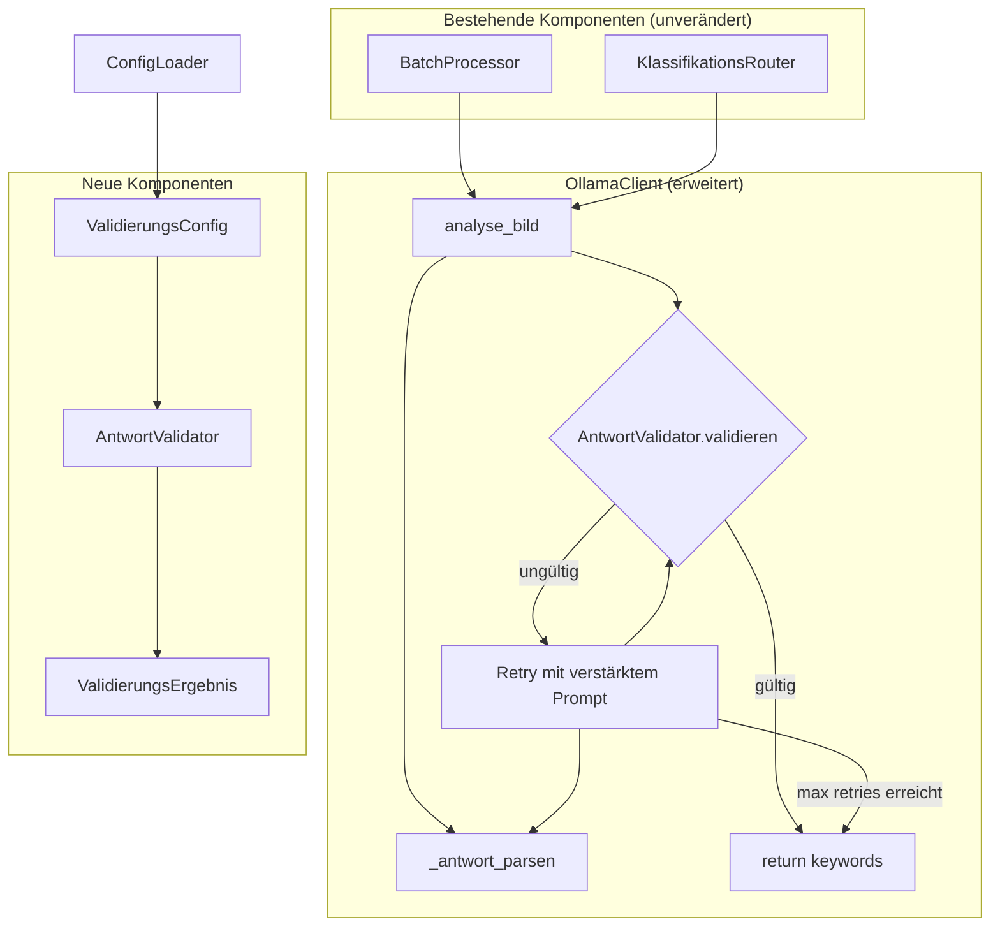
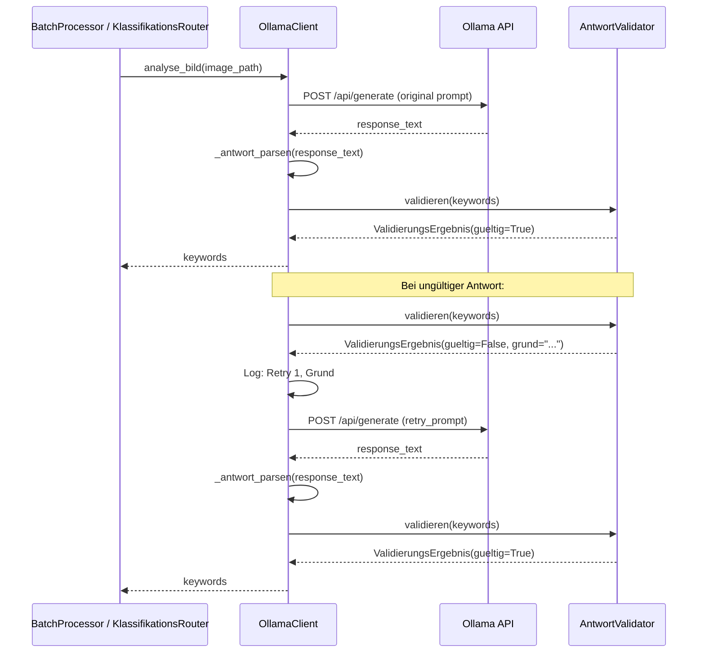

# Design-Dokument: Keyword Response Validation

## Übersicht

Dieses Design beschreibt eine Antwort-Validierungsschicht mit automatischem Retry-Mechanismus für den Lightroom Ollama Keyword Generator. Ollama-Vision-Modelle liefern gelegentlich statt einer komma-getrennten Stichwortliste erklärende Texte, Ablehnungen oder ganze Sätze. Die neue `AntwortValidator`-Klasse erkennt solche ungültigen Antworten anhand konfigurierbarer Heuristiken (durchschnittliche Wortanzahl, Ablehnungsphrasen, Einzeleintrag-Länge, leere Listen) und löst automatische Retries mit einem verstärkten Prompt aus.

### Technologie-Entscheidungen

- **Validierungslogik**: Reine Python-Klasse (`AntwortValidator`) ohne externe Abhängigkeiten — die Heuristiken arbeiten auf `list[str]` und benötigen nur String-Operationen
- **Integration**: Einbettung in `OllamaClient.analyse_bild()` — transparent für `BatchProcessor` und `KlassifikationsRouter`, keine Änderungen an deren Code nötig
- **Konfiguration**: Erweiterung der bestehenden YAML-Konfiguration über `ConfigLoader` mit neuen optionalen Feldern und sinnvollen Standardwerten
- **Datenmodelle**: Python `dataclass` für `ValidierungsErgebnis` und `ValidierungsConfig` — konsistent mit dem bestehenden Codebase-Stil
- **Logging**: Python `logging`-Modul — wie im restlichen Projekt

### Design-Rationale

Die Validierung wird bewusst in `OllamaClient.analyse_bild()` integriert statt in `BatchProcessor` oder `KlassifikationsRouter`, weil:
1. Jeder Aufrufer von `analyse_bild()` automatisch von der Validierung profitiert
2. Der Retry-Mechanismus Zugriff auf die Ollama-API benötigt, den nur der Client hat
3. `BatchProcessor` und `KlassifikationsRouter` unverändert bleiben (Anforderung 4.3)

## Architektur



### Verarbeitungsablauf mit Validierung



## Komponenten und Schnittstellen

### AntwortValidator

Reine Validierungslogik ohne Seiteneffekte. Prüft eine geparste Stichwortliste anhand konfigurierbarer Heuristiken.

```python
class AntwortValidator:
    """Validiert geparste Ollama-Antworten auf Stichwortlisten-Qualität."""

    # Vordefinierte Ablehnungsphrasen (deutsch + englisch)
    ABLEHNUNGS_PHRASEN: list[str] = [
        "ich kann nicht",
        "ich kann das nicht",
        "i cannot",
        "i can't",
        "i'm sorry",
        "es tut mir leid",
        "nicht möglich",
        "unable to",
        "i'm unable",
        "kann ich nicht",
        "leider kann",
        "leider nicht",
        "sorry",
    ]

    def __init__(self, config: ValidierungsConfig) -> None:
        self._config = config

    def validieren(self, keywords: list[str]) -> ValidierungsErgebnis:
        """Prüft ob die Stichwortliste gültig ist.

        Prüfreihenfolge:
        1. Leere Liste → ungültig
        2. Ablehnungsphrase in einem Eintrag → ungültig
        3. Einzeleintrag mit zu vielen Wörtern → ungültig
        4. Durchschnittliche Wortanzahl zu hoch → ungültig
        5. Sonst → gültig
        """
        ...

    def _durchschnittliche_wortanzahl(self, keywords: list[str]) -> float:
        """Berechnet die durchschnittliche Wortanzahl über alle Einträge."""
        ...

    def _enthaelt_ablehnungs_phrase(self, text: str) -> str | None:
        """Prüft case-insensitiv ob der Text eine Ablehnungsphrase enthält.
        Gibt die gefundene Phrase zurück oder None."""
        ...
```

### ValidierungsConfig

Konfigurationsparameter für die Validierung, als Dataclass.

```python
@dataclass
class ValidierungsConfig:
    """Konfiguration für die Antwort-Validierung."""

    max_retries: int = 2
    wortanzahl_schwellenwert: float = 3.0
    einzeleintrag_schwellenwert: int = 4
    retry_prompt: str = (
        "Antworte ausschließlich mit einer komma-getrennten Liste von Stichwörtern. "
        "Keine Sätze, keine Erklärungen, keine Einleitungen. "
        "Nur Stichwörter, getrennt durch Kommas."
    )
```

### ValidierungsErgebnis

Ergebnis einer Validierungsprüfung.

```python
@dataclass
class ValidierungsErgebnis:
    """Ergebnis einer Antwort-Validierung."""

    gueltig: bool
    grund: str | None = None  # Begründung bei Ungültigkeit
```

### OllamaClient (erweitert)

Die bestehende `analyse_bild()`-Methode wird um Validierung und Retry erweitert. Die Signatur bleibt identisch.

```python
class OllamaClient:
    def __init__(
        self,
        endpoint: str,
        model_name: str,
        prompt_template: str,
        validierungs_config: ValidierungsConfig | None = None,
    ) -> None:
        # ... bestehende Felder ...
        self._validator = AntwortValidator(validierungs_config or ValidierungsConfig())
        self._validierungs_config = validierungs_config or ValidierungsConfig()

    def analyse_bild(self, image_path: str) -> list[str]:
        """Sendet ein Bild an Ollama, validiert die Antwort und wiederholt bei Bedarf.

        1. Bild senden mit original prompt_template
        2. Antwort parsen
        3. Validieren
        4. Bei ungültiger Antwort: bis max_retries mit retry_prompt wiederholen
        5. Letzte Antwort zurückgeben (auch wenn nach max_retries noch ungültig)
        """
        ...
```

### ConfigLoader (erweitert)

Parst den neuen optionalen `validation`-Abschnitt aus der YAML-Konfiguration.

```python
class ConfigLoader:
    def load(self, config_path: str) -> Config:
        # ... bestehende Logik ...
        # Neuer Abschnitt:
        config.validierung = self._parse_validation(data.get("validation"))

    def _parse_validation(self, validation_data: dict | None) -> ValidierungsConfig:
        """Parst den optionalen 'validation'-Abschnitt.
        Gibt ValidierungsConfig mit Standardwerten zurück wenn None."""
        ...
```

### Config (erweitert)

```python
@dataclass
class Config:
    # ... bestehende Felder ...
    validierung: ValidierungsConfig = field(default_factory=ValidierungsConfig)
```

## Datenmodelle

### Neue Dataclasses

```python
@dataclass
class ValidierungsConfig:
    """Konfiguration für die Antwort-Validierung."""
    max_retries: int = 2
    wortanzahl_schwellenwert: float = 3.0
    einzeleintrag_schwellenwert: int = 4
    retry_prompt: str = (
        "Antworte ausschließlich mit einer komma-getrennten Liste von Stichwörtern. "
        "Keine Sätze, keine Erklärungen, keine Einleitungen. "
        "Nur Stichwörter, getrennt durch Kommas."
    )

@dataclass
class ValidierungsErgebnis:
    """Ergebnis einer Antwort-Validierung."""
    gueltig: bool
    grund: str | None = None
```

### Erweiterung der YAML-Konfiguration

```yaml
# Bestehende Konfiguration ...

# Neuer optionaler Abschnitt
validation:
  max_retries: 2
  word_count_threshold: 3
  single_entry_threshold: 4
  retry_prompt: >
    Antworte ausschließlich mit einer komma-getrennten Liste von Stichwörtern.
    Keine Sätze, keine Erklärungen, keine Einleitungen.
    Nur Stichwörter, getrennt durch Kommas.
```

### Ablehnungsphrasen (vordefiniert)

Die folgenden Phrasen werden case-insensitiv als Teilstring-Match geprüft:

| Sprache | Phrasen |
|---------|---------|
| Deutsch | "ich kann nicht", "ich kann das nicht", "es tut mir leid", "nicht möglich", "kann ich nicht", "leider kann", "leider nicht" |
| Englisch | "i cannot", "i can't", "i'm sorry", "unable to", "i'm unable", "sorry" |

## Correctness Properties

*Eine Property ist eine Eigenschaft oder ein Verhalten, das über alle gültigen Ausführungen eines Systems hinweg gelten sollte — im Wesentlichen eine formale Aussage darüber, was das System tun soll. Properties bilden die Brücke zwischen menschenlesbaren Spezifikationen und maschinenverifizierbaren Korrektheitsgarantien.*

### Property 1: Durchschnittliche Wortanzahl erkennt Sätze

*Für alle* Listen von Strings, bei denen die durchschnittliche Wortanzahl pro Eintrag den konfigurierten Schwellenwert überschreitet, soll der AntwortValidator die Antwort als ungültig bewerten und eine Begründung zurückgeben, die auf die Wortanzahl hinweist.

**Validates: Requirements 1.2**

### Property 2: Ablehnungsphrasen-Erkennung (case-insensitiv, Teilstring)

*Für alle* Stichwortlisten und *für alle* bekannten Ablehnungsphrasen in beliebiger Groß-/Kleinschreibung: Wenn ein beliebiger Eintrag der Liste die Ablehnungsphrase als Teilstring enthält, soll der AntwortValidator die Antwort als ungültig bewerten.

**Validates: Requirements 1.3, 6.2, 6.4**

### Property 3: Einzeleintrag-Erkennung

*Für alle* Antworten, die aus genau einem Eintrag bestehen, dessen Wortanzahl den konfigurierten Einzeleintrag-Schwellenwert überschreitet, soll der AntwortValidator die Antwort als ungültig bewerten.

**Validates: Requirements 1.4**

### Property 4: Ergebnis-Struktur-Invariante

*Für alle* Eingaben an den AntwortValidator soll das zurückgegebene ValidierungsErgebnis folgende Invariante erfüllen: Wenn `gueltig` False ist, dann ist `grund` ein nicht-leerer String. Wenn `gueltig` True ist, dann ist `grund` None.

**Validates: Requirements 1.5**

### Property 5: Gültige Stichwortlisten werden akzeptiert

*Für alle* nicht-leeren Listen von kurzen Stichwörtern (jeder Eintrag hat höchstens 2 Wörter, kein Eintrag enthält eine Ablehnungsphrase), soll der AntwortValidator die Antwort als gültig bewerten.

**Validates: Requirements 1.7**

### Property 6: Retry-Anzahl ist begrenzt

*Für alle* konfigurierten Max_Retries-Werte und *für alle* Sequenzen von ungültigen Antworten soll die Gesamtanzahl der API-Aufrufe in `analyse_bild()` höchstens `1 + max_retries` betragen.

**Validates: Requirements 2.2**

### Property 7: Validierungs-Konfiguration Round-Trip

*Für alle* gültigen Kombinationen von Validierungsparametern (max_retries, wortanzahl_schwellenwert, einzeleintrag_schwellenwert, retry_prompt) soll das Serialisieren als YAML-Dictionary und anschließende Parsen durch den ConfigLoader eine äquivalente ValidierungsConfig ergeben.

**Validates: Requirements 5.1**

## Fehlerbehandlung

### Fehlerbehandlungsstrategie

Die Validierung und der Retry-Mechanismus fügen keine neuen fatalen Fehler hinzu. Bestehende Fehler (`OllamaConnectionError`, `OllamaApiError`, `ImageReadError`) werden unverändert weitergereicht — auch während Retries.

| Situation | Verhalten | Anforderung |
|-----------|-----------|-------------|
| Antwort ungültig, Retries verfügbar | Retry mit verstärktem Prompt, Logging | 2.1, 3.1 |
| Antwort ungültig, Retries erschöpft | Letzte Antwort zurückgeben, Warnung loggen | 2.3, 3.2 |
| Retry erfolgreich | Gültige Antwort zurückgeben, Erfolg loggen | 3.3 |
| API-Fehler während Retry | Exception propagieren (kein Fangen) | — |
| Leere Antwort nach allen Retries | Leere Liste zurückgeben (wie bisher) | 1.6 |

### Logging-Format

Retry-Events werden mit dem bestehenden `logging`-Modul protokolliert:

```
INFO  - Retry 1/2 für /pfad/zum/bild.jpg: Durchschnittliche Wortanzahl 5.3 überschreitet Schwellenwert 3.0
INFO  - Retry 2/2 für /pfad/zum/bild.jpg: Ablehnungsphrase erkannt: "ich kann nicht"
WARNING - Alle 2 Retries erschöpft für /pfad/zum/bild.jpg — verwende letzte Antwort
INFO  - Retry 1 erfolgreich für /pfad/zum/bild.jpg
```

## Teststrategie

### Dualer Testansatz

Die Teststrategie kombiniert Property-basierte Tests (Hypothesis) und Unit-Tests (pytest).

#### Property-basierte Tests (pytest + Hypothesis)

- **Bibliothek**: [Hypothesis](https://hypothesis.readthedocs.io/)
- **Mindestens 100 Iterationen** pro Property-Test
- **Tag-Format**: `Feature: keyword-response-validation, Property {nummer}: {text}`

| Property | Komponente | Was wird getestet |
|----------|-----------|-------------------|
| Property 1 | AntwortValidator | Listen mit hoher durchschnittlicher Wortanzahl → ungültig |
| Property 2 | AntwortValidator | Ablehnungsphrasen in beliebiger Schreibweise → ungültig |
| Property 3 | AntwortValidator | Einzeleinträge mit zu vielen Wörtern → ungültig |
| Property 4 | AntwortValidator | Ergebnis-Struktur: gueltig↔grund Konsistenz |
| Property 5 | AntwortValidator | Kurze, saubere Stichwortlisten → gültig |
| Property 6 | OllamaClient | API-Aufrufe ≤ 1 + max_retries |
| Property 7 | ConfigLoader | Validierungs-Config YAML Round-Trip |

#### Unit-Tests (pytest)

| Test | Komponente | Was wird getestet | Anforderung |
|------|-----------|-------------------|-------------|
| Leere Liste ungültig | AntwortValidator | `validieren([])` → ungültig | 1.6 |
| Validator wird aufgerufen | OllamaClient | Validator wird in analyse_bild() verwendet | 1.1 |
| Retry mit verstärktem Prompt | OllamaClient | Retry verwendet retry_prompt statt original | 2.1, 2.4 |
| Letzte Antwort bei erschöpften Retries | OllamaClient | Gibt letzte Antwort zurück | 2.3 |
| Konfigurierbarer Retry-Prompt | OllamaClient | Custom retry_prompt wird verwendet | 2.5 |
| Retry-Logging mit Details | OllamaClient | Log enthält Bildpfad, Retry-Nr, Grund | 3.1 |
| Warnung bei erschöpften Retries | OllamaClient | WARNING-Log mit Bildpfad und Retry-Anzahl | 3.2 |
| Erfolgs-Logging bei Retry | OllamaClient | INFO-Log bei erfolgreichem Retry | 3.3 |
| Standardwerte korrekt | ValidierungsConfig | max_retries=2, wortanzahl=3, einzeleintrag=4 | 5.2, 5.3 |
| Vordefinierte Phrasen vorhanden | AntwortValidator | ABLEHNUNGS_PHRASEN enthält alle geforderten | 6.1, 6.3 |

#### Integrationstests

| Test | Was wird getestet | Anforderung |
|------|-------------------|-------------|
| BatchProcessor mit Validierung | Retry funktioniert transparent durch BatchProcessor | 4.1 |
| KlassifikationsRouter mit Validierung | Retry funktioniert transparent durch KlassifikationsRouter | 4.2 |

### Testinfrastruktur

- **Hypothesis-Strategien**: Custom Strategies für Stichwortlisten (kurze Keywords, lange Sätze, Listen mit Ablehnungsphrasen)
- **Mock-Ollama-API**: `unittest.mock.patch` auf `requests.post` für Retry-Tests — kontrollierte Sequenzen von gültigen/ungültigen Antworten
- **Log-Capture**: `caplog` Fixture von pytest für Logging-Tests

