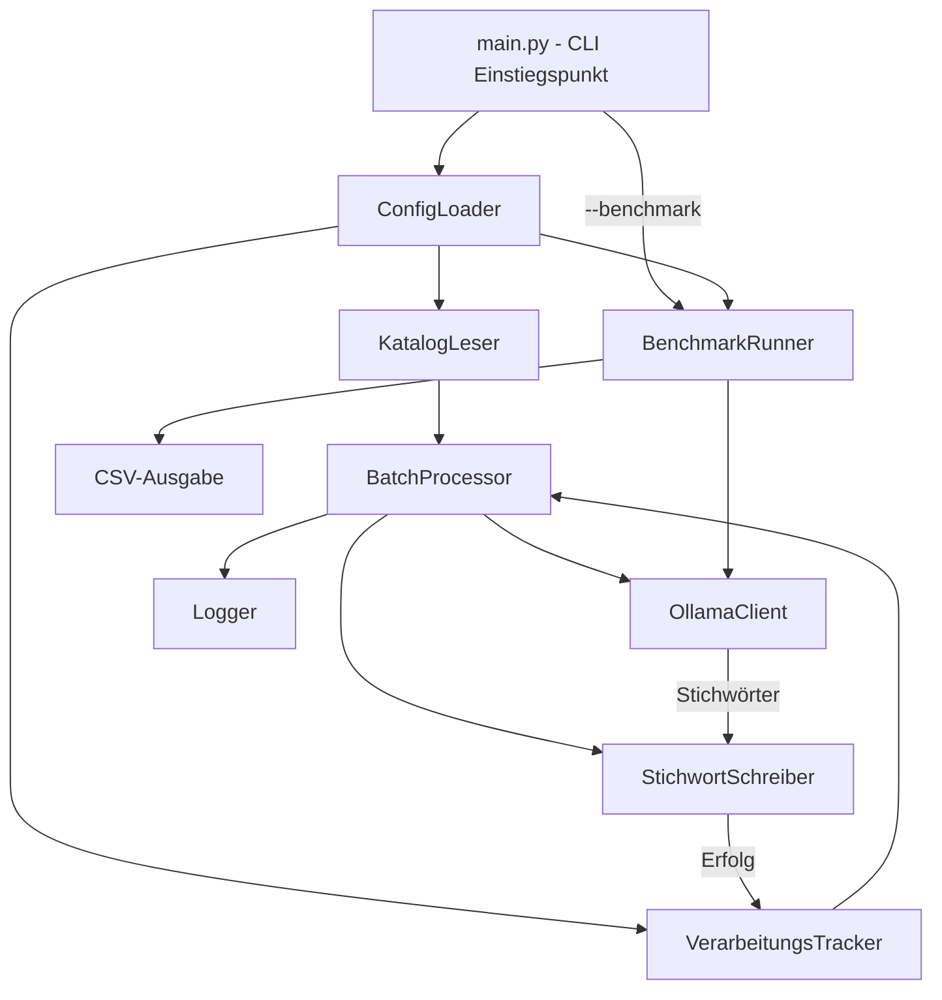
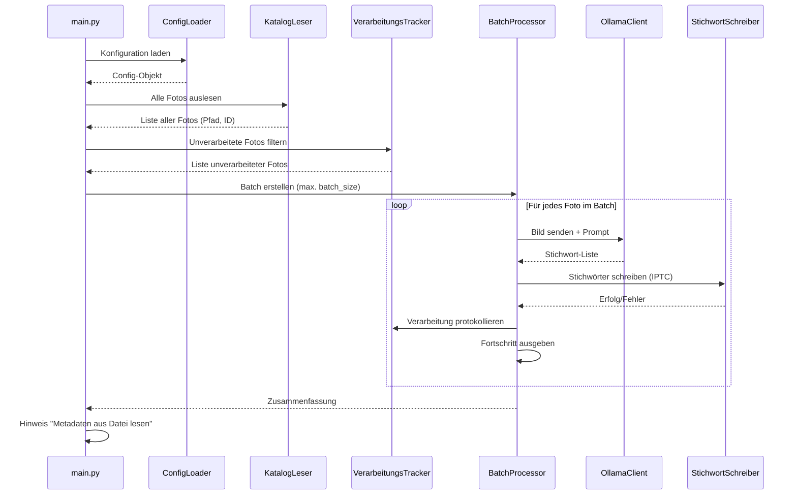
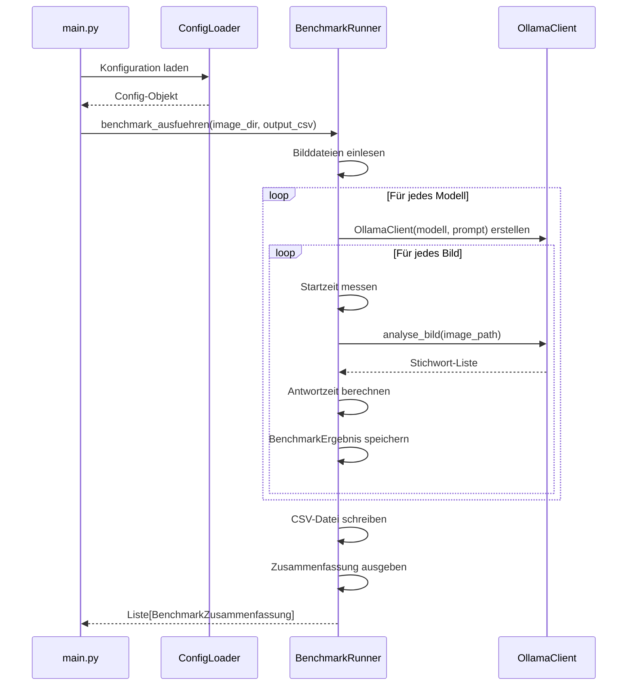

# Design-Dokument: Lightroom Ollama Keywords

## Übersicht

Dieses Design beschreibt eine Python-basierte CLI-Anwendung, die automatisch Stichwörter für Fotos in einem Adobe Lightroom Classic Katalog generiert. Die Anwendung liest unverarbeitete Fotos aus dem Lightroom-Katalog (SQLite-Datenbank), sendet sie an eine lokale Ollama-Instanz mit einem multimodalen LLM (z.B. llava, bakllava) zur Bildanalyse, und schreibt die generierten Stichwörter als IPTC-Keywords in die Bilddateien zurück. Ein Tracking-Mechanismus verhindert doppelte Verarbeitung und ermöglicht gezielte Neuverarbeitung bei Modellwechsel.

### Technologie-Entscheidungen

- **Programmiersprache**: Python 3.10+ — breite Bibliotheksunterstützung, gute SQLite-Integration, einfache REST-API-Kommunikation
- **Ollama-Kommunikation**: `requests`-Bibliothek gegen die Ollama REST API (`POST /api/generate`) mit base64-kodierten Bildern
- **Katalog-Zugriff**: `sqlite3` (Python-Standardbibliothek) im Read-Only-Modus — der Lightroom-Katalog wird nur gelesen, nie beschrieben
- **Metadaten-Schreiber**: [ExifTool](https://exiftool.org/) via `pyexiftool` — der De-facto-Standard für IPTC/XMP-Metadaten, zuverlässig unter Windows
- **Tracking-Datenbank**: SQLite via `sqlite3` — leichtgewichtig, keine externe Abhängigkeit, unterstützt mehrere Einträge pro Foto
- **Konfiguration**: YAML-Datei via `pyyaml` — gut lesbar, flexibel
- **Logging**: Python `logging`-Modul — Standardbibliothek, konfigurierbar

## Architektur

Die Anwendung folgt einer Pipeline-Architektur mit klar getrennten Komponenten:



### Komponentenübersicht

1. **main.py** — CLI-Einstiegspunkt, orchestriert den Gesamtablauf
2. **ConfigLoader** — Liest und validiert die YAML-Konfigurationsdatei
3. **KatalogLeser** — Liest Foto-Einträge aus dem Lightroom-Katalog (SQLite, read-only)
4. **VerarbeitungsTracker** — Verwaltet die Tracking-Datenbank (welches Foto mit welchem Modell verarbeitet wurde)
5. **OllamaClient** — Kommuniziert mit der Ollama REST API für Bildanalyse
6. **StichwortSchreiber** — Schreibt IPTC-Keywords via ExifTool in Bilddateien
7. **BatchProcessor** — Orchestriert die Batch-Verarbeitung mit Fortschrittsanzeige
8. **BenchmarkRunner** — Orchestriert den Benchmark-Modus: sendet Testbilder an mehrere Modelle, misst Antwortzeiten und erzeugt CSV-Ergebnisse

### Verarbeitungsablauf



## Komponenten und Schnittstellen

### ConfigLoader

Verantwortlich für das Laden und Validieren der YAML-Konfigurationsdatei.

```python
@dataclass
class Config:
    catalog_path: str           # Pfad zur .lrcat-Datei
    ollama_endpoint: str        # Standard: "http://localhost:11434"
    model_name: str             # z.B. "llava", "bakllava"
    batch_size: int             # Standard: 50
    prompt_template: str        # Prompt für die Bildanalyse
    tracking_db_path: str       # Pfad zur Tracking-SQLite-DB
    log_file_path: str          # Pfad zur Logdatei
    exiftool_path: str          # Pfad zur exiftool.exe (optional)
    benchmark_models: list[str] # Liste der Modelle für den Benchmark-Modus
    benchmark_output_csv: str   # Pfad zur CSV-Ergebnisdatei

class ConfigLoader:
    def load(self, config_path: str) -> Config:
        """Lädt die Konfiguration aus einer YAML-Datei.
        Raises ConfigError bei fehlenden Pflichtparametern."""
        ...
```

**Pflichtparameter**: `catalog_path`, `model_name`
**Optionale Parameter mit Standardwerten**:
- `ollama_endpoint`: `"http://localhost:11434"`
- `batch_size`: `50`
- `prompt_template`: `"Describe this image with descriptive keywords. Return only a comma-separated list of keywords."`
- `tracking_db_path`: `"./tracking.db"`
- `log_file_path`: `"./keyword_generator.log"`

### KatalogLeser

Liest Foto-Einträge aus dem Lightroom-Katalog. Der Katalog wird im Read-Only-Modus geöffnet, um Konflikte mit Lightroom zu vermeiden.

```python
@dataclass
class FotoEintrag:
    image_id: int       # Adobe_images.id_local
    file_path: str      # Vollständiger Dateipfad (root + folder + filename)

class KatalogLeser:
    def __init__(self, catalog_path: str):
        """Öffnet den Katalog im Read-Only-Modus.
        Raises KatalogError wenn Datei nicht gefunden/lesbar."""
        ...

    def alle_fotos_lesen(self) -> list[FotoEintrag]:
        """Liest alle Foto-Einträge mit vollständigem Dateipfad.
        
        SQL-Query verbindet:
        - Adobe_images (Foto-ID)
        - AgLibraryFile (Dateiname, Extension)
        - AgLibraryFolder (relativer Pfad)
        - AgLibraryRootFolder (absoluter Basispfad)
        
        Gibt: root_folder.absolutePath + folder.pathFromRoot + file.baseName + '.' + file.extension
        """
        ...

    def close(self):
        """Schließt die Datenbankverbindung."""
        ...
```

**SQL-Query für Foto-Pfade** (basierend auf dem Lightroom-Katalog-Schema):

```sql
SELECT
    image.id_local AS image_id,
    root_folder.absolutePath || folder.pathFromRoot || file.baseName || '.' || file.extension AS file_path
FROM
    Adobe_images AS image
JOIN AgLibraryFile AS file
    ON image.rootFile = file.id_local
JOIN AgLibraryFolder AS folder
    ON file.folder = folder.id_local
JOIN AgLibraryRootFolder AS root_folder
    ON folder.rootFolder = root_folder.id_local
```

### VerarbeitungsTracker

Verwaltet eine separate SQLite-Datenbank, die protokolliert, welche Fotos mit welchem Modell verarbeitet wurden.

```python
@dataclass
class VerarbeitungsEintrag:
    file_path: str
    model_name: str
    model_version: str
    timestamp: str          # ISO 8601

class VerarbeitungsTracker:
    def __init__(self, db_path: str):
        """Öffnet/erstellt die Tracking-Datenbank.
        Raises TrackerError bei Dateizugriffsproblemen."""
        ...

    def ist_verarbeitet(self, file_path: str, model_name: str) -> bool:
        """Prüft ob ein Foto bereits mit dem angegebenen Modell verarbeitet wurde."""
        ...

    def unverarbeitete_filtern(self, fotos: list[FotoEintrag], model_name: str) -> list[FotoEintrag]:
        """Filtert eine Liste von Fotos und gibt nur unverarbeitete zurück."""
        ...

    def verarbeitung_speichern(self, file_path: str, model_name: str, model_version: str) -> None:
        """Speichert einen Verarbeitungseintrag."""
        ...

    def close(self):
        """Schließt die Datenbankverbindung."""
        ...
```

### OllamaClient

Kommuniziert mit der lokalen Ollama-Instanz über die REST API.

```python
class OllamaClient:
    def __init__(self, endpoint: str, model_name: str, prompt_template: str):
        ...

    def analyse_bild(self, image_path: str) -> list[str]:
        """Sendet ein Bild an Ollama und gibt eine Liste von Stichwörtern zurück.
        
        1. Bild als base64 kodieren
        2. POST /api/generate mit model, prompt, images
        3. Antwort parsen (Komma-getrennte Stichwörter)
        
        Raises OllamaConnectionError wenn API nicht erreichbar.
        Raises OllamaApiError bei API-Fehlern.
        Raises ImageReadError wenn Bilddatei nicht lesbar.
        """
        ...

    def _bild_zu_base64(self, image_path: str) -> str:
        """Liest eine Bilddatei und gibt den base64-kodierten Inhalt zurück."""
        ...

    def _antwort_parsen(self, response_text: str) -> list[str]:
        """Parst die LLM-Antwort in eine Liste einzelner Stichwörter.
        Bereinigt Whitespace, entfernt leere Einträge und Duplikate."""
        ...

    def modell_version_abfragen(self) -> str:
        """Fragt die Modellversion über GET /api/show ab."""
        ...
```

**Ollama API Request-Format** ([Ollama API Docs](https://docs.ollama.com/api/generate)):

```json
{
    "model": "llava",
    "prompt": "Describe this image with descriptive keywords...",
    "stream": false,
    "images": ["<base64-kodiertes-bild>"]
}
```

### StichwortSchreiber

Schreibt IPTC-Keywords in Bilddateien via ExifTool.

```python
class StichwortSchreiber:
    def __init__(self, exiftool_path: str | None = None):
        """Initialisiert ExifTool im Batch-Modus."""
        ...

    def stichwörter_schreiben(self, file_path: str, keywords: list[str]) -> None:
        """Schreibt Stichwörter als IPTC-Keywords in die Bilddatei.
        
        1. Vorhandene Keywords lesen
        2. Neue Keywords mit vorhandenen zusammenführen (ohne Duplikate)
        3. Zusammengeführte Keywords schreiben
        
        Verwendet ExifTool-Tags:
        - IPTC:Keywords
        - XMP:Subject (für XMP-Kompatibilität)
        
        Raises MetadataWriteError bei Schreibfehlern.
        """
        ...

    def _vorhandene_keywords_lesen(self, file_path: str) -> set[str]:
        """Liest bereits vorhandene IPTC-Keywords aus der Bilddatei."""
        ...

    def close(self):
        """Beendet den ExifTool-Prozess."""
        ...
```

**ExifTool-Kommando** zum Hinzufügen von Keywords (ohne vorhandene zu überschreiben):

```bash
exiftool -IPTC:Keywords+=keyword1 -IPTC:Keywords+=keyword2 -XMP:Subject+=keyword1 -XMP:Subject+=keyword2 foto.jpg
```

### BatchProcessor

Orchestriert die Verarbeitung eines Batches mit Fortschrittsanzeige und Zusammenfassung.

```python
@dataclass
class BatchErgebnis:
    verarbeitet: int
    fehler: int
    dauer_sekunden: float
    fehler_details: list[str]

class BatchProcessor:
    def __init__(self, ollama: OllamaClient, schreiber: StichwortSchreiber,
                 tracker: VerarbeitungsTracker, model_name: str, model_version: str):
        ...

    def batch_verarbeiten(self, fotos: list[FotoEintrag]) -> BatchErgebnis:
        """Verarbeitet einen Batch von Fotos.
        
        Für jedes Foto:
        1. Fortschritt auf Konsole ausgeben
        2. Bild über OllamaClient analysieren
        3. Stichwörter über StichwortSchreiber schreiben
        4. Verarbeitung im Tracker protokollieren
        5. Bei Fehler: protokollieren und mit nächstem Foto fortfahren
        
        Am Ende: Zusammenfassung ausgeben.
        """
        ...
```

### BenchmarkRunner

Orchestriert den Benchmark-Modus: sendet jedes Testbild an alle konfigurierten Modelle, misst die Antwortzeit und erzeugt eine CSV-Ergebnisdatei.

```python
@dataclass
class BenchmarkErgebnis:
    model_name: str
    image_name: str
    keywords: list[str]
    response_time_ms: float
    error: str | None = None

@dataclass
class BenchmarkZusammenfassung:
    model_name: str
    bilder_verarbeitet: int
    durchschnitt_ms: float
    fehler: int

class BenchmarkRunner:
    def __init__(self, config: Config):
        """Initialisiert den BenchmarkRunner mit der Konfiguration.
        Erstellt pro Modell einen eigenen OllamaClient mit demselben Prompt."""
        ...

    def benchmark_ausfuehren(self, image_dir: str, output_csv: str) -> list[BenchmarkZusammenfassung]:
        """Führt den Benchmark durch.
        
        1. Alle Bilddateien im angegebenen Verzeichnis einlesen
        2. Für jedes Modell in config.benchmark_models:
           a. OllamaClient mit dem Modell und dem gemeinsamen Prompt erstellen
           b. Für jedes Bild:
              - Startzeit messen
              - Bild über OllamaClient analysieren
              - Endzeit messen, Antwortzeit berechnen
              - BenchmarkErgebnis speichern
           c. Bei Fehler: Fehler protokollieren, mit nächstem Bild fortfahren
        3. Ergebnisse als CSV schreiben
        4. Zusammenfassung pro Modell berechnen und zurückgeben
        
        Raises BenchmarkError wenn das Bildverzeichnis nicht existiert.
        """
        ...

    def _bilder_einlesen(self, image_dir: str) -> list[str]:
        """Liest alle Bilddateien (jpg, jpeg, png, tiff, raw) aus dem Verzeichnis.
        Raises BenchmarkError wenn Verzeichnis nicht existiert oder leer ist."""
        ...

    def _ergebnisse_als_csv_schreiben(self, ergebnisse: list[BenchmarkErgebnis], output_path: str) -> None:
        """Schreibt die Benchmark-Ergebnisse als CSV-Datei.
        
        CSV-Spalten: model,image,keywords,response_time_ms
        Keywords werden als semikolon-getrennte Liste in einem Feld gespeichert.
        """
        ...

    def _zusammenfassung_berechnen(self, ergebnisse: list[BenchmarkErgebnis]) -> list[BenchmarkZusammenfassung]:
        """Berechnet pro Modell: Anzahl verarbeiteter Bilder, Durchschnittszeit, Fehleranzahl."""
        ...

    def _zusammenfassung_ausgeben(self, zusammenfassungen: list[BenchmarkZusammenfassung]) -> None:
        """Gibt die Zusammenfassung formatiert auf der Konsole aus."""
        ...
```

### Benchmark-Verarbeitungsablauf



## Datenmodelle

### Konfigurationsdatei (config.yaml)

```yaml
# Pflichtparameter
catalog_path: "C:/Users/Fotograf/Pictures/Lightroom/MeinKatalog.lrcat"
model_name: "llava"

# Optionale Parameter
ollama_endpoint: "http://localhost:11434"
batch_size: 50
prompt_template: >
  Analyze this photograph and provide descriptive keywords.
  Return ONLY a comma-separated list of single-word or two-word keywords.
  Focus on: subjects, actions, emotions, colors, lighting, composition, location type.
tracking_db_path: "./tracking.db"
log_file_path: "./keyword_generator.log"
exiftool_path: null  # null = ExifTool im PATH suchen

# Benchmark-Modus
benchmark_models:
  - "moondream"
  - "llava-phi3"
  - "gemma3"
  - "llava:7b"
  - "minicpm-v"
benchmark_output_csv: "./benchmark_results.csv"
```

### Tracking-Datenbank Schema

```sql
CREATE TABLE IF NOT EXISTS verarbeitungen (
    id INTEGER PRIMARY KEY AUTOINCREMENT,
    file_path TEXT NOT NULL,
    model_name TEXT NOT NULL,
    model_version TEXT NOT NULL,
    timestamp TEXT NOT NULL,  -- ISO 8601
    UNIQUE(file_path, model_name)
);

CREATE INDEX IF NOT EXISTS idx_file_model 
    ON verarbeitungen(file_path, model_name);
```

Der `UNIQUE`-Constraint auf `(file_path, model_name)` stellt sicher, dass pro Foto und Modell nur ein Eintrag existiert. Bei erneutem Verarbeiten mit demselben Modell wird der bestehende Eintrag aktualisiert (via `INSERT OR REPLACE`).

### Lightroom-Katalog Tabellen (Read-Only)

Die relevanten Tabellen im Lightroom-Katalog (.lrcat SQLite-Datenbank):

| Tabelle | Relevante Felder | Beschreibung |
|---------|-----------------|--------------|
| `Adobe_images` | `id_local`, `rootFile` | Zentrale Foto-Tabelle |
| `AgLibraryFile` | `id_local`, `baseName`, `extension`, `folder` | Dateiinformationen |
| `AgLibraryFolder` | `id_local`, `pathFromRoot`, `rootFolder` | Ordnerstruktur |
| `AgLibraryRootFolder` | `id_local`, `absolutePath` | Wurzelverzeichnisse |

### Ollama API Datenstrukturen

**Request:**
```json
{
    "model": "llava",
    "prompt": "...",
    "stream": false,
    "images": ["base64-string"]
}
```

**Response:**
```json
{
    "model": "llava",
    "created_at": "2024-01-01T00:00:00Z",
    "response": "landscape, mountain, sunset, golden hour, nature, scenic, clouds, sky",
    "done": true
}
```

### CSV-Ausgabeformat (Benchmark)

Die Benchmark-Ergebnisse werden als CSV-Datei mit folgender Struktur gespeichert:

```csv
model,image,keywords,response_time_ms
moondream,sunset_beach.jpg,"sunset;beach;ocean;golden hour;waves",1234
llava:7b,sunset_beach.jpg,"sunset;beach;sand;water;sky;warm colors",2567
gemma3,sunset_beach.jpg,"coastal;sunset;landscape;nature",1890
moondream,portrait_studio.jpg,"portrait;woman;studio;lighting",987
```

- **model**: Name des Ollama-Modells
- **image**: Dateiname des Testbildes (ohne Verzeichnispfad)
- **keywords**: Semikolon-getrennte Liste der generierten Stichwörter (in Anführungszeichen, da Kommas im CSV-Trennzeichen sind)
- **response_time_ms**: Antwortzeit in Millisekunden (nur die Ollama-API-Antwortzeit, ohne Bild-Laden)

### Fehlerklassen-Hierarchie

```python
class KeywordGeneratorError(Exception):
    """Basisklasse für alle Fehler."""

class ConfigError(KeywordGeneratorError):
    """Fehler beim Laden/Validieren der Konfiguration."""

class KatalogError(KeywordGeneratorError):
    """Fehler beim Zugriff auf den Lightroom-Katalog."""

class TrackerError(KeywordGeneratorError):
    """Fehler beim Zugriff auf die Tracking-Datenbank."""

class OllamaConnectionError(KeywordGeneratorError):
    """Ollama-API nicht erreichbar."""

class OllamaApiError(KeywordGeneratorError):
    """Ollama-API hat einen Fehler zurückgegeben."""

class ImageReadError(KeywordGeneratorError):
    """Bilddatei kann nicht gelesen werden."""

class MetadataWriteError(KeywordGeneratorError):
    """Fehler beim Schreiben der Metadaten."""

class BenchmarkError(KeywordGeneratorError):
    """Fehler im Benchmark-Modus (z.B. Bildverzeichnis nicht gefunden)."""
```

## Correctness Properties

*Eine Property ist eine Eigenschaft oder ein Verhalten, das über alle gültigen Ausführungen eines Systems hinweg gelten sollte — im Wesentlichen eine formale Aussage darüber, was das System tun soll. Properties bilden die Brücke zwischen menschenlesbaren Spezifikationen und maschinenverifizierbaren Korrektheitsgarantien.*

### Property 1: Katalog-Pfad-Zusammensetzung

*Für alle* gültigen Einträge in einer Lightroom-Katalog-Datenbank (mit Einträgen in Adobe_images, AgLibraryFile, AgLibraryFolder, AgLibraryRootFolder) soll der KatalogLeser jeden Eintrag mit einem Dateipfad zurückgeben, der exakt der Konkatenation von `absolutePath + pathFromRoot + baseName + '.' + extension` entspricht, und die Anzahl der zurückgegebenen Einträge soll der Anzahl der Einträge in Adobe_images entsprechen.

**Validiert: Anforderung 1.1**

### Property 2: Unverarbeitete-Fotos-Filterung

*Für alle* Listen von Fotos und *für alle* Mengen von Tracking-Einträgen soll die Filterung durch den VerarbeitungsTracker genau die Fotos zurückgeben, für die kein Tracking-Eintrag mit dem aktuell konfigurierten Modellnamen existiert. Die Ergebnismenge soll eine Teilmenge der Eingabeliste sein, und kein Foto in der Ergebnismenge soll einen passenden Tracking-Eintrag haben.

**Validiert: Anforderungen 1.2, 1.3**

### Property 3: Antwort-Parsing

*Für alle* Komma-getrennten Strings soll das Parsen der Ollama-Antwort eine Liste von Stichwörtern zurückgeben, in der jedes Stichwort keine führenden oder nachfolgenden Whitespace-Zeichen enthält und keine leeren Strings enthalten sind.

**Validiert: Anforderung 2.3**

### Property 4: Keyword-Zusammenführung ohne Datenverlust

*Für alle* Mengen von vorhandenen Keywords und *für alle* Mengen von neuen Keywords soll die Zusammenführung ein Ergebnis liefern, das (a) alle vorhandenen Keywords enthält, (b) alle neuen Keywords enthält, und (c) keine Duplikate aufweist. Die Ergebnismenge soll exakt der Vereinigung der beiden Eingabemengen entsprechen.

**Validiert: Anforderungen 3.2, 3.3**

### Property 5: Tracking Round-Trip mit Modellspezifität

*Für alle* gültigen Dateipfade und *für alle* Paare von unterschiedlichen Modellnamen gilt: Wenn ein Foto mit Modell A als verarbeitet gespeichert wird, dann soll (a) `ist_verarbeitet(foto, modell_A)` true zurückgeben, und (b) `ist_verarbeitet(foto, modell_B)` false zurückgeben. Zusätzlich soll nach dem Speichern eines Eintrags für Modell B dasselbe Foto für beide Modelle als verarbeitet gelten.

**Validiert: Anforderungen 4.1, 4.3, 4.4**

### Property 6: Batch-Größen-Begrenzung

*Für alle* Listen von unverarbeiteten Fotos und *für alle* positiven Batch-Größen soll die Anzahl der tatsächlich verarbeiteten Fotos kleiner oder gleich der konfigurierten Batch-Größe sein.

**Validiert: Anforderung 5.1**

### Property 7: Konfigurations-Round-Trip

*Für alle* gültigen Konfigurationsobjekte soll das Serialisieren als YAML und anschließende Deserialisieren ein äquivalentes Konfigurationsobjekt ergeben, bei dem alle Feldwerte identisch sind.

**Validiert: Anforderung 6.1**

### Property 8: Validierung fehlender Pflichtparameter

*Für alle* Konfigurationen, bei denen genau ein Pflichtparameter fehlt, soll der ConfigLoader einen ConfigError auslösen, dessen Fehlermeldung den Namen des fehlenden Parameters enthält.

**Validiert: Anforderung 6.2**

### Property 9: Benchmark-CSV Round-Trip

*Für alle* Listen von BenchmarkErgebnis-Objekten (mit gültigen Modellnamen, Bildnamen, Keyword-Listen und positiven Antwortzeiten) soll das Schreiben als CSV und anschließende Einlesen eine äquivalente Liste ergeben, bei der für jeden Eintrag Modellname, Bildname, Keywords und Antwortzeit übereinstimmen.

**Validiert: Anforderung 9.4**

### Property 10: Benchmark verwendet einheitlichen Prompt

*Für alle* Listen von Modellnamen und *für alle* Testbilder soll der BenchmarkRunner für jede Modell-Bild-Kombination exakt denselben Prompt-Text an die Ollama-API senden. Der Prompt-Text soll dem konfigurierten `prompt_template` entsprechen.

**Validiert: Anforderung 9.3**

### Property 11: Benchmark-Zusammenfassung Konsistenz

*Für alle* Listen von BenchmarkErgebnis-Objekten soll die berechnete Zusammenfassung pro Modell folgende Invarianten erfüllen: (a) die Summe aus `bilder_verarbeitet` und `fehler` entspricht der Gesamtanzahl der Testbilder, (b) die `durchschnitt_ms` entspricht dem arithmetischen Mittel der Antwortzeiten der erfolgreich verarbeiteten Bilder, und (c) jedes konfigurierte Modell erscheint genau einmal in der Zusammenfassung.

**Validiert: Anforderung 9.8**

## Fehlerbehandlung

### Fehlerbehandlungsstrategie

Die Anwendung unterscheidet zwischen **fatalen Fehlern** (Abbruch) und **nicht-fatalen Fehlern** (Weiterverarbeitung):

| Fehlertyp | Verhalten | Anforderung |
|-----------|-----------|-------------|
| Konfiguration ungültig/unvollständig | Abbruch mit Fehlermeldung | 6.2 |
| Lightroom-Katalog nicht lesbar | Abbruch mit Pfad in Fehlermeldung | 1.4 |
| Tracking-DB nicht zugreifbar | Abbruch mit Pfad in Fehlermeldung | 4.5 |
| Ollama-API nicht erreichbar | Abbruch mit Endpunkt in Fehlermeldung | 2.4 |
| Ollama-API gibt Fehler zurück | Protokollieren, nächstes Foto | 2.5 |
| Bilddatei nicht lesbar | Protokollieren, nächstes Foto | 2.6 |
| Metadaten-Schreiben fehlgeschlagen | Protokollieren, nächstes Foto | 3.4 |
| Benchmark-Bildverzeichnis nicht gefunden | Abbruch mit Pfad in Fehlermeldung | 9.5 |
| Benchmark-Modell nicht verfügbar | Protokollieren, nächstes Modell | 9.7 |

### Fehlerprotokollierung

Jeder Fehler wird mit folgenden Informationen protokolliert:
- **Zeitstempel** (ISO 8601)
- **Dateipfad** (falls zutreffend)
- **Fehlertyp** (Klasse)
- **Fehlerbeschreibung** (Nachricht)
- **Kontext** (z.B. Ollama-Endpunkt, Modellname)

### Graceful Degradation

Bei nicht-fatalen Fehlern (einzelne Fotos) wird die Verarbeitung fortgesetzt. Der Fehler wird:
1. In die Logdatei geschrieben
2. Im BatchErgebnis als Fehler gezählt
3. In der Zusammenfassung am Ende aufgelistet

## Teststrategie

### Dualer Testansatz

Die Teststrategie kombiniert Unit-Tests und Property-basierte Tests für umfassende Abdeckung:

#### Property-basierte Tests (pytest + Hypothesis)

- **Bibliothek**: [Hypothesis](https://hypothesis.readthedocs.io/) für Python
- **Mindestens 100 Iterationen** pro Property-Test
- **Jeder Test referenziert** die zugehörige Design-Property
- **Tag-Format**: `Feature: lightroom-ollama-keywords, Property {nummer}: {text}`

| Property | Komponente | Was wird getestet |
|----------|-----------|-------------------|
| Property 1 | KatalogLeser | Pfad-Zusammensetzung aus DB-Einträgen |
| Property 2 | VerarbeitungsTracker | Filterung unverarbeiteter Fotos |
| Property 3 | OllamaClient | Parsing der Komma-getrennten Antwort |
| Property 4 | StichwortSchreiber | Keyword-Zusammenführung (Mengenvereinigung) |
| Property 5 | VerarbeitungsTracker | Round-Trip und Modellspezifität |
| Property 6 | BatchProcessor | Batch-Größen-Begrenzung |
| Property 7 | ConfigLoader | YAML-Serialisierung/Deserialisierung |
| Property 8 | ConfigLoader | Validierung fehlender Pflichtparameter |
| Property 9 | BenchmarkRunner | CSV Round-Trip (Schreiben/Lesen) |
| Property 10 | BenchmarkRunner | Einheitlicher Prompt für alle Modelle |
| Property 11 | BenchmarkRunner | Zusammenfassung-Konsistenz (Summen, Durchschnitt) |

#### Unit-Tests (pytest)

Spezifische Beispiel- und Fehlertests:

| Test | Komponente | Was wird getestet |
|------|-----------|-------------------|
| Katalog nicht gefunden | KatalogLeser | Fehlermeldung mit Pfad (1.4) |
| Ollama nicht erreichbar | OllamaClient | Fehlermeldung mit Endpunkt (2.4) |
| Ollama API-Fehler | OllamaClient | Fehler protokolliert, nächstes Foto (2.5) |
| Bilddatei nicht lesbar | OllamaClient | Fehler protokolliert, nächstes Foto (2.6) |
| Metadaten-Schreibfehler | StichwortSchreiber | Fehler protokolliert, nächstes Foto (3.4) |
| Tracking-DB nicht zugreifbar | VerarbeitungsTracker | Fehlermeldung mit Pfad (4.5) |
| Standardwerte | ConfigLoader | Korrekte Standardwerte (6.3) |
| Lightroom-Hinweis | BatchProcessor | Hinweis auf "Metadaten aus Datei lesen" (7.1) |
| Log-Pfad-Ausgabe | main | Logdatei-Pfad auf Konsole (8.4) |
| Benchmark-Verzeichnis nicht gefunden | BenchmarkRunner | BenchmarkError mit Pfad (9.5) |
| Benchmark-Modell nicht verfügbar | BenchmarkRunner | Fehler protokolliert, nächstes Modell (9.7) |
| Benchmark-Zusammenfassung | BenchmarkRunner | Konsolenausgabe mit Statistiken (9.8) |

#### Integrationstests

| Test | Was wird getestet |
|------|-------------------|
| IPTC/XMP-Schreiben | Keywords korrekt in Testbild geschrieben und lesbar (3.1, 7.2) |
| Ollama-Kommunikation | Request/Response mit Mock-Server (2.1, 2.2) |
| End-to-End Batch | Vollständiger Durchlauf mit Test-Katalog, Mock-Ollama, Testbildern |
| Benchmark End-to-End | Vollständiger Benchmark-Durchlauf mit Mock-Ollama, mehreren Modellen, CSV-Validierung (9.1, 9.2, 9.4) |

### Testinfrastruktur

- **Test-Lightroom-Katalog**: SQLite-Datenbank mit dem Lightroom-Schema und Testdaten
- **Mock-Ollama-Server**: Einfacher HTTP-Server, der vordefinierte Antworten liefert
- **Testbilder**: Kleine JPEG-Dateien für Metadaten-Tests
- **Temporäre Verzeichnisse**: `pytest tmp_path` für Tracking-DB und Logdateien
