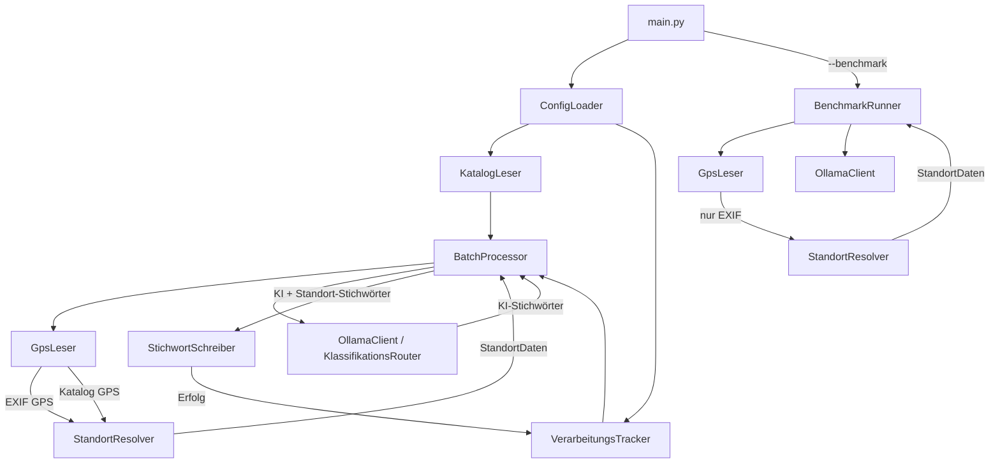
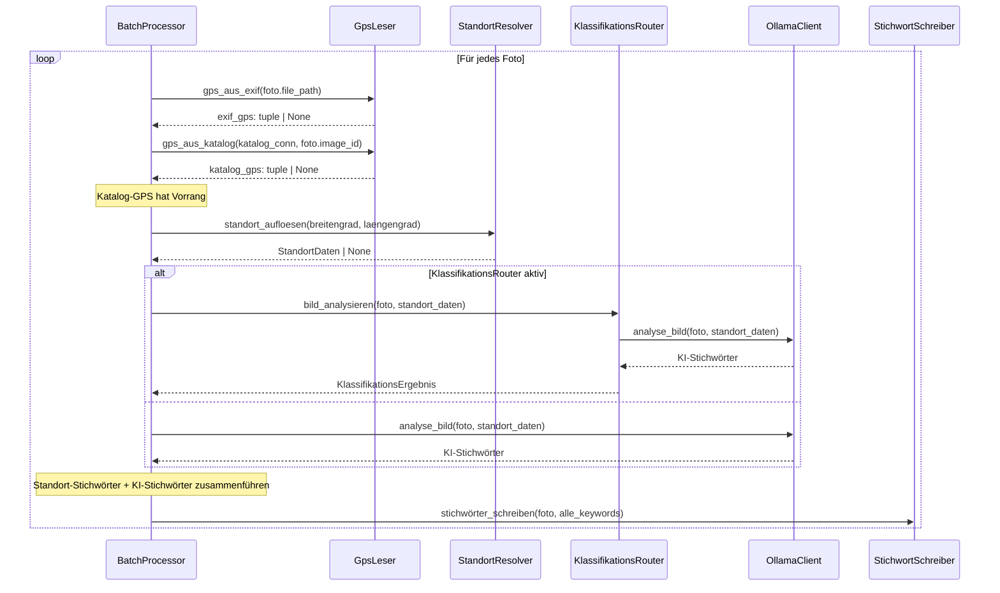

# Design-Dokument: Location-Based Keywords

## Übersicht

Dieses Design erweitert den Lightroom Ollama Keyword Generator um standortbasierte Stichwörter. GPS-Koordinaten werden aus zwei Quellen gelesen: EXIF-Metadaten der Bilddateien (via `exifread`) und aus der Lightroom-Katalog-Datenbank (`AgHarvestedExifMetadata`-Tabelle). Mittels Offline-Reverse-Geocoding (`reverse_geocoder`-Paket) werden die Koordinaten in Ortsnamen aufgelöst. Die Standortdaten fließen auf zwei Wegen ein: (a) als zusätzliche Stichwörter (Stadt, Region, Land) direkt in die Bilddatei und (b) als Kontext-Präfix im Ollama-Prompt für kontextbezogenere KI-Stichwörter.

### Technologie-Entscheidungen

- **GPS aus EXIF**: `exifread`-Bibliothek — leichtgewichtig, rein Python, liest GPS-Tags ohne externe Abhängigkeiten
- **GPS aus Lightroom-Katalog**: Bestehender `KatalogLeser` wird um eine GPS-Query auf `AgHarvestedExifMetadata` erweitert
- **Reverse-Geocoding**: `reverse_geocoder`-Paket — vollständig offline, nutzt GeoNames-Daten mit K-D-Tree für schnelle Suche, gibt Stadt (`name`), Region (`admin1`) und Ländercode (`cc`) zurück
- **Datenmodell**: Frozen Dataclass `StandortDaten` — unveränderlich, konsistent mit bestehendem Dataclass-Stil
- **Priorität**: Lightroom-Katalog-GPS hat Vorrang vor EXIF-GPS (manuell korrigierte Koordinaten)
- **Benchmark-Modus**: Nur EXIF-GPS (kein Katalog-Zugriff)

## Architektur

Die neuen Module `gps_leser` und `standort_resolver` werden in die bestehende Pipeline eingefügt. Der Datenfluss ist: GPS lesen → Reverse-Geocoding → StandortDaten an OllamaClient/KlassifikationsRouter übergeben + Standort-Stichwörter mit KI-Stichwörtern zusammenführen.



### Verarbeitungsablauf (Batch-Modus)




## Komponenten und Schnittstellen

### Neues Modul: `gps_leser.py`

Liest GPS-Koordinaten aus zwei Quellen: EXIF-Metadaten und Lightroom-Katalog.

```python
"""GpsLeser – Liest GPS-Koordinaten aus EXIF-Metadaten und Lightroom-Katalog."""

import exifread

class GpsLeser:
    """Liest GPS-Koordinaten aus verschiedenen Quellen."""

    def gps_aus_exif(self, image_path: str) -> tuple[float, float] | None:
        """Liest GPS-Koordinaten aus EXIF-Metadaten einer Bilddatei.

        Liest die Tags GPS GPSLatitude, GPS GPSLatitudeRef,
        GPS GPSLongitude, GPS GPSLongitudeRef und konvertiert
        die DMS-Werte (Grad/Minuten/Sekunden) in Dezimalgrad.

        Returns:
            (breitengrad, laengengrad) als Dezimalgrad oder None.
        """
        ...

    def gps_aus_katalog(
        self, katalog_conn: sqlite3.Connection, image_id: int
    ) -> tuple[float, float] | None:
        """Liest GPS-Koordinaten aus der Lightroom-Katalog-Datenbank.

        Query auf AgHarvestedExifMetadata:
            SELECT gpsLatitude, gpsLongitude
            FROM AgHarvestedExifMetadata
            WHERE image = :image_id AND hasGps = 1.0

        Returns:
            (breitengrad, laengengrad) als Dezimalgrad oder None.
        """
        ...

    def gps_ermitteln(
        self,
        image_path: str,
        katalog_conn: sqlite3.Connection | None = None,
        image_id: int | None = None,
    ) -> tuple[float, float] | None:
        """Ermittelt GPS-Koordinaten mit Priorität: Katalog > EXIF.

        1. Wenn katalog_conn und image_id vorhanden: Katalog-GPS versuchen
        2. Wenn kein Katalog-GPS: EXIF-GPS versuchen
        3. Wenn beides None: None zurückgeben

        Returns:
            (breitengrad, laengengrad) oder None.
        """
        ...

    @staticmethod
    def _dms_zu_dezimal(
        dms_wert: exifread.utils.Ratio, referenz: str
    ) -> float:
        """Konvertiert EXIF DMS-Werte (Grad, Minuten, Sekunden) in Dezimalgrad.

        Negative Werte für S (Süd) und W (West).
        """
        ...
```

**EXIF-GPS-Tags** (gelesen via `exifread`):
- `GPS GPSLatitude`: z.B. `[52, 31, 12.34]` (Grad, Minuten, Sekunden)
- `GPS GPSLatitudeRef`: `N` oder `S`
- `GPS GPSLongitude`: z.B. `[13, 24, 56.78]`
- `GPS GPSLongitudeRef`: `E` oder `W`

**Lightroom-Katalog SQL-Query**:
```sql
SELECT gpsLatitude, gpsLongitude
FROM AgHarvestedExifMetadata
WHERE image = :image_id AND hasGps = 1.0
```

### Neues Modul: `standort_resolver.py`

Offline-Reverse-Geocoding mittels `reverse_geocoder`-Paket.

```python
"""StandortResolver – Offline-Reverse-Geocoding von GPS-Koordinaten."""

class StandortResolver:
    """Löst GPS-Koordinaten in Ortsnamen auf (offline)."""

    def standort_aufloesen(
        self, breitengrad: float, laengengrad: float
    ) -> StandortDaten | None:
        """Löst GPS-Koordinaten in StandortDaten auf.

        1. Koordinaten validieren (-90..90, -180..180, nicht (0.0, 0.0))
        2. reverse_geocoder.search() aufrufen
        3. Ergebnis in StandortDaten umwandeln:
           - stadt = result['name']
           - region = result['admin1']
           - land = result['cc']

        Returns:
            StandortDaten oder None bei ungültigen Koordinaten.

        Raises:
            ImportError: Wenn reverse_geocoder nicht installiert ist.
        """
        ...
```

**`reverse_geocoder` API**:
```python
import reverse_geocoder as rg
results = rg.search([(52.52, 13.405)])
# [{'name': 'Berlin', 'cc': 'DE', 'lat': '52.52437',
#   'lon': '13.41053', 'admin1': 'Berlin', 'admin2': 'Berlin'}]
```

### Erweiterung: `models.py` — `StandortDaten`

```python
@dataclass(frozen=True)
class StandortDaten:
    """Aufgelöste Standortinformationen für ein Foto."""

    stadt: str
    region: str
    land: str
    breitengrad: float
    laengengrad: float

    def __post_init__(self) -> None:
        if not (-90.0 <= self.breitengrad <= 90.0):
            raise ValueError(
                f"Breitengrad muss zwischen -90 und 90 liegen: {self.breitengrad}"
            )
        if not (-180.0 <= self.laengengrad <= 180.0):
            raise ValueError(
                f"Längengrad muss zwischen -180 und 180 liegen: {self.laengengrad}"
            )

    def als_stichwort_liste(self) -> list[str]:
        """Gibt nicht-leere Felder (stadt, region, land) als Liste zurück."""
        return [f for f in (self.stadt, self.region, self.land) if f]
```

### Erweiterung: `models.py` — `Config`

```python
@dataclass
class StandortConfig:
    """Konfiguration für die Standort-Funktionalität."""
    enabled: bool = False

@dataclass
class Config:
    # ... bestehende Felder ...
    standort: StandortConfig = field(default_factory=StandortConfig)
```

### Erweiterung: `config_loader.py`

```python
class ConfigLoader:
    def load(self, config_path: str) -> Config:
        # ... bestehender Code ...
        return Config(
            # ... bestehende Felder ...
            standort=self._parse_standort(data.get("location")),
        )

    def _parse_standort(self, location_data: dict | None) -> StandortConfig:
        """Parst den optionalen 'location'-Abschnitt.

        Wenn location_data None ist: StandortConfig(enabled=False).
        Sonst: enabled aus location_data['enabled'] lesen.
        """
        if location_data is None:
            return StandortConfig(enabled=False)
        return StandortConfig(enabled=location_data.get("enabled", False))
```

### Erweiterung: `ollama_client.py` — `analyse_bild()`

```python
class OllamaClient:
    def analyse_bild(
        self, image_path: str, standort_daten: StandortDaten | None = None
    ) -> list[str]:
        """Erweitert um optionalen Standort-Kontext.

        Wenn standort_daten vorhanden:
            prompt = standort_prefix + "\n" + self.prompt_template
            z.B. "Dieses Foto wurde in Berlin, Berlin, DE aufgenommen."
        Sonst:
            prompt = self.prompt_template (unverändert)
        """
        ...

    @staticmethod
    def _standort_prompt_prefix(standort_daten: StandortDaten) -> str:
        """Erzeugt den Standort-Kontext-Prefix für den Prompt.

        Format: "Dieses Foto wurde in {stadt}, {land} aufgenommen."
        Wenn region != stadt: "Dieses Foto wurde in {stadt}, {region}, {land} aufgenommen."
        """
        ...
```

### Erweiterung: `klassifikations_router.py` — `bild_analysieren()`

```python
class KlassifikationsRouter:
    def bild_analysieren(
        self, image_path: str, standort_daten: StandortDaten | None = None
    ) -> KlassifikationsErgebnis:
        """Erweitert um optionalen Standort-Kontext.

        Der standort_daten-Parameter wird an den internen
        OllamaClient.analyse_bild() weitergereicht, sowohl für
        die Klassifikation als auch für die Stichwort-Generierung.
        """
        ...
```

### Erweiterung: `batch_processor.py`

```python
class BatchProcessor:
    def __init__(
        self,
        # ... bestehende Parameter ...
        gps_leser: GpsLeser | None = None,
        standort_resolver: StandortResolver | None = None,
        katalog_conn: sqlite3.Connection | None = None,
    ) -> None:
        ...

    def batch_verarbeiten(self, fotos: list[FotoEintrag]) -> BatchErgebnis:
        """Erweitert um Standort-Verarbeitung.

        Für jedes Foto:
        1. GPS ermitteln (Katalog > EXIF)
        2. Standort auflösen
        3. KI-Analyse mit Standort-Kontext
        4. Standort-Stichwörter + KI-Stichwörter zusammenführen
        5. Zusammengeführte Stichwörter schreiben
        """
        ...

    @staticmethod
    def _keywords_zusammenfuehren(
        ki_keywords: list[str], standort_daten: StandortDaten | None
    ) -> list[str]:
        """Führt KI-Keywords und Standort-Stichwörter zusammen.

        1. Standort-Stichwörter aus standort_daten.als_stichwort_liste()
        2. Leere Strings herausfiltern
        3. Mit KI-Keywords vereinigen (ohne Duplikate, Reihenfolge: Standort zuerst)
        """
        ...
```

### Erweiterung: `benchmark_runner.py`

```python
class BenchmarkRunner:
    def benchmark_ausfuehren(self, image_dir: str, output_csv: str) -> ...:
        """Erweitert um Standort-Verarbeitung.

        - GPS nur aus EXIF (kein Katalog)
        - Standort-Kontext in Prompt injizieren
        - Aufgelöster Standort als zusätzliche CSV-Spalte 'standort'
        """
        ...
```

### Erweiterung: YAML-Konfiguration

```yaml
# Optionaler Abschnitt — fehlt = deaktiviert
location:
  enabled: true
```


## Datenmodelle

### StandortDaten (frozen dataclass)

| Feld | Typ | Beschreibung | Validierung |
|------|-----|-------------|-------------|
| `stadt` | `str` | Stadtname (z.B. "Berlin") | — |
| `region` | `str` | Region/Bundesland (z.B. "Berlin") | — |
| `land` | `str` | Ländercode ISO 3166-1 alpha-2 (z.B. "DE") | — |
| `breitengrad` | `float` | Breitengrad in Dezimalgrad | -90.0 ≤ x ≤ 90.0 |
| `laengengrad` | `float` | Längengrad in Dezimalgrad | -180.0 ≤ x ≤ 180.0 |

**Methoden**:
- `als_stichwort_liste() -> list[str]`: Gibt `[stadt, region, land]` zurück, wobei leere Strings herausgefiltert werden. Ergebnis hat 0–3 Elemente.

### StandortConfig (dataclass)

| Feld | Typ | Standard | Beschreibung |
|------|-----|---------|-------------|
| `enabled` | `bool` | `False` | Standort-Funktionalität aktiviert/deaktiviert |

### Erweiterung BenchmarkErgebnis

| Neues Feld | Typ | Beschreibung |
|-----------|-----|-------------|
| `standort` | `str \| None` | Aufgelöster Standort als String (z.B. "Berlin, DE") |

### GPS-Prioritätslogik

```
Batch-Modus:     Katalog-GPS → EXIF-GPS → None
Benchmark-Modus: EXIF-GPS → None (kein Katalog)
```

### Standort-Prompt-Prefix Format

```
Wenn stadt != region:
    "Dieses Foto wurde in {stadt}, {region}, {land} aufgenommen."
Wenn stadt == region:
    "Dieses Foto wurde in {stadt}, {land} aufgenommen."
```

Beispiele:
- `StandortDaten("Berlin", "Berlin", "DE", ...)` → `"Dieses Foto wurde in Berlin, DE aufgenommen."`
- `StandortDaten("München", "Bayern", "DE", ...)` → `"Dieses Foto wurde in München, Bayern, DE aufgenommen."`


## Correctness Properties

*Eine Property ist eine Eigenschaft oder ein Verhalten, das über alle gültigen Ausführungen eines Systems hinweg gelten sollte — im Wesentlichen eine formale Aussage darüber, was das System tun soll. Properties bilden die Brücke zwischen menschenlesbaren Spezifikationen und maschinenverifizierbaren Korrektheitsgarantien.*

### Property 1: DMS-zu-Dezimalgrad-Konvertierung

*Für alle* gültigen EXIF-GPS-Werte in DMS-Format (Grad zwischen 0–90/180, Minuten zwischen 0–59, Sekunden zwischen 0.0–59.999) mit Referenz N/S/E/W soll die Konvertierung in Dezimalgrad den mathematisch korrekten Wert ergeben: `dezimal = grad + minuten/60 + sekunden/3600`, negiert bei S oder W. Das Ergebnis soll für Breitengrad im Bereich [-90, 90] und für Längengrad im Bereich [-180, 180] liegen.

**Validates: Requirements 1.1**

### Property 2: Katalog-GPS Round-Trip

*Für alle* gültigen GPS-Koordinatenpaare (breitengrad ∈ [-90, 90], laengengrad ∈ [-180, 180]) soll das Schreiben in eine Test-SQLite-Datenbank (AgHarvestedExifMetadata-Schema) und anschließende Lesen über `gps_aus_katalog` ein äquivalentes Koordinatenpaar zurückgeben.

**Validates: Requirements 2.1**

### Property 3: Katalog-GPS hat Vorrang vor EXIF-GPS

*Für alle* Paare von unterschiedlichen GPS-Koordinaten (exif_gps ≠ katalog_gps) soll `gps_ermitteln` mit beiden Quellen immer die Katalog-GPS-Koordinaten zurückgeben.

**Validates: Requirements 2.3**

### Property 4: Gültige Koordinaten erzeugen gültige StandortDaten

*Für alle* gültigen GPS-Koordinatenpaare (breitengrad ∈ [-90, 90], laengengrad ∈ [-180, 180], nicht (0.0, 0.0)) soll `standort_aufloesen` ein StandortDaten-Objekt mit nicht-leeren Werten für `stadt` und `land` zurückgeben.

**Validates: Requirements 3.1, 3.5**

### Property 5: Keyword-Zusammenführung ist vollständig, duplikatfrei und ohne leere Strings

*Für alle* Listen von KI-Keywords und *für alle* StandortDaten-Instanzen soll die Zusammenführung ein Ergebnis liefern, das (a) alle KI-Keywords enthält, (b) alle nicht-leeren Standort-Stichwörter enthält, (c) keine Duplikate aufweist, und (d) keine leeren Strings enthält. Wenn StandortDaten None ist, soll das Ergebnis exakt den KI-Keywords entsprechen.

**Validates: Requirements 4.1, 4.2, 4.3, 4.4**

### Property 6: Standort-Prompt-Konstruktion bewahrt Original-Prompt

*Für alle* StandortDaten-Instanzen und *für alle* Prompt-Strings soll der konstruierte Prompt (a) mit dem Standort-Kontext-Prefix beginnen, (b) den Original-Prompt unverändert als Suffix enthalten, und (c) die Ortsnamen aus StandortDaten im Prefix enthalten. Wenn StandortDaten None ist, soll der Prompt exakt dem Original-Prompt entsprechen.

**Validates: Requirements 5.1, 5.4**

### Property 7: StandortDaten-Koordinatenvalidierung

*Für alle* Breitengrad-Werte außerhalb [-90, 90] oder Längengrad-Werte außerhalb [-180, 180] soll die Erstellung einer StandortDaten-Instanz einen ValueError auslösen. *Für alle* Werte innerhalb der gültigen Bereiche soll die Erstellung erfolgreich sein.

**Validates: Requirements 8.3**

### Property 8: als_stichwort_liste gibt nur nicht-leere Felder zurück

*Für alle* StandortDaten-Instanzen soll `als_stichwort_liste()` eine Liste zurückgeben, die (a) nur Elemente aus {stadt, region, land} enthält, (b) keine leeren Strings enthält, (c) genau die nicht-leeren Werte von stadt, region und land enthält, und (d) eine Länge zwischen 0 und 3 hat.

**Validates: Requirements 8.4, 8.5**

### Property 9: Benchmark-CSV Standort Round-Trip

*Für alle* Listen von BenchmarkErgebnis-Objekten mit optionalem `standort`-Feld soll das Schreiben als CSV und anschließende Einlesen die Standort-Werte korrekt wiedergeben. Einträge mit Standort sollen den Standort-String in der CSV-Spalte enthalten, Einträge ohne Standort sollen einen leeren Wert haben.

**Validates: Requirements 6.5**

### Property 10: Config-Location-Parsing

*Für alle* gültigen Boolean-Werte für `enabled` soll das Erstellen einer YAML-Konfiguration mit `location.enabled` und anschließende Parsen über ConfigLoader ein Config-Objekt mit `standort.enabled` gleich dem ursprünglichen Wert ergeben. Wenn der `location`-Abschnitt fehlt, soll `standort.enabled` False sein.

**Validates: Requirements 7.1, 7.2, 7.3**


## Fehlerbehandlung

### Fehlerbehandlungsstrategie

| Fehlertyp | Verhalten | Anforderung |
|-----------|-----------|-------------|
| EXIF-GPS nicht lesbar / ungültiges Format | None zurückgeben, Warnung protokollieren, Foto ohne Standort verarbeiten | 1.2, 1.3 |
| Katalog-GPS nicht vorhanden | None zurückgeben, auf EXIF-GPS zurückfallen | 2.2 |
| `reverse_geocoder` nicht installiert | ImportError mit beschreibender Meldung auslösen | 3.3 |
| Koordinaten (0.0, 0.0) | None zurückgeben (Null Island) | 3.4 |
| `reverse_geocoder` interner Fehler | None zurückgeben, Warnung protokollieren | — |
| Standort-Funktionalität deaktiviert | GPS-Lesung und Reverse-Geocoding überspringen | 7.4 |
| Kein GPS für ein Foto (bei aktivierter Funktion) | Foto ohne Standort-Stichwörter verarbeiten | 7.5 |

### Neue Fehlerklasse

```python
class GpsLeseError(KeywordGeneratorError):
    """Fehler beim Lesen von GPS-Daten."""
```

Diese Fehlerklasse wird intern verwendet, aber nicht nach außen propagiert — GPS-Fehler führen zu graceful degradation (None zurückgeben), nicht zu Abbruch.

### Graceful Degradation

Die Standort-Funktionalität ist vollständig optional. Bei jedem Fehler in der GPS-/Standort-Pipeline wird das Foto ohne Standort-Stichwörter verarbeitet. Die KI-Analyse läuft in jedem Fall weiter. Fehler werden protokolliert, aber die Verarbeitung wird nicht unterbrochen.

## Teststrategie

### Dualer Testansatz

Die Teststrategie kombiniert Unit-Tests und Property-basierte Tests für umfassende Abdeckung.

#### Property-basierte Tests (pytest + Hypothesis)

- **Bibliothek**: [Hypothesis](https://hypothesis.readthedocs.io/) für Python
- **Mindestens 100 Iterationen** pro Property-Test
- **Jeder Test referenziert** die zugehörige Design-Property
- **Tag-Format**: `Feature: location-based-keywords, Property {nummer}: {text}`

| Property | Komponente | Was wird getestet |
|----------|-----------|-------------------|
| Property 1 | GpsLeser | DMS-zu-Dezimalgrad-Konvertierung |
| Property 2 | GpsLeser | Katalog-GPS Round-Trip (SQLite schreiben/lesen) |
| Property 3 | GpsLeser | Katalog-GPS Priorität über EXIF-GPS |
| Property 4 | StandortResolver | Gültige Koordinaten → gültige StandortDaten |
| Property 5 | BatchProcessor | Keyword-Zusammenführung (vollständig, duplikatfrei, keine leeren Strings) |
| Property 6 | OllamaClient | Standort-Prompt-Konstruktion bewahrt Original-Prompt |
| Property 7 | StandortDaten | Koordinatenvalidierung (ValueError bei ungültigen Werten) |
| Property 8 | StandortDaten | als_stichwort_liste gibt nur nicht-leere Felder zurück |
| Property 9 | BenchmarkRunner | CSV Standort Round-Trip |
| Property 10 | ConfigLoader | Config-Location-Parsing Round-Trip |

#### Unit-Tests (pytest)

Spezifische Beispiel- und Fehlertests:

| Test | Komponente | Was wird getestet |
|------|-----------|-------------------|
| EXIF ohne GPS | GpsLeser | None bei fehlenden GPS-Tags (1.2) |
| EXIF ungültiges Format | GpsLeser | None + Logging bei korrupten GPS-Daten (1.3) |
| Katalog ohne GPS | GpsLeser | None bei fehlendem Katalog-GPS (2.2) |
| Null Island (0.0, 0.0) | StandortResolver | None bei (0.0, 0.0) (3.4) |
| reverse_geocoder nicht installiert | StandortResolver | ImportError mit Meldung (3.3) |
| Prompt ohne Standort | OllamaClient | Unverändert bei None (5.2) |
| Config ohne location | ConfigLoader | standort.enabled = False (7.2) |
| Config location.enabled=false | ConfigLoader | standort.enabled = False (7.3) |
| Benchmark nur EXIF | BenchmarkRunner | Kein Katalog-Zugriff (6.2) |
| Benchmark ohne GPS | BenchmarkRunner | Verarbeitung ohne Standort (6.4) |
| StandortDaten frozen | StandortDaten | FrozenInstanceError bei Mutation (8.2) |

#### Integrationstests

| Test | Was wird getestet |
|------|-------------------|
| GPS → Standort → Keywords | Vollständiger Pfad: EXIF-GPS lesen → Reverse-Geocoding → Standort-Stichwörter in Keyword-Liste |
| Batch mit Standort | BatchProcessor mit aktivierter Standort-Funktion, Mock-Ollama |
| Benchmark mit Standort-CSV | BenchmarkRunner erzeugt CSV mit Standort-Spalte |

### Testinfrastruktur

- **Test-SQLite-DB**: Minimales AgHarvestedExifMetadata-Schema mit GPS-Testdaten
- **Mock-exifread**: Generierte EXIF-GPS-Tags für Property-Tests
- **Mock-reverse_geocoder**: Für Tests, die nicht die echte GeoNames-Datenbank benötigen
- **Hypothesis-Strategien**: Custom Strategies für GPS-Koordinaten, DMS-Werte, StandortDaten
