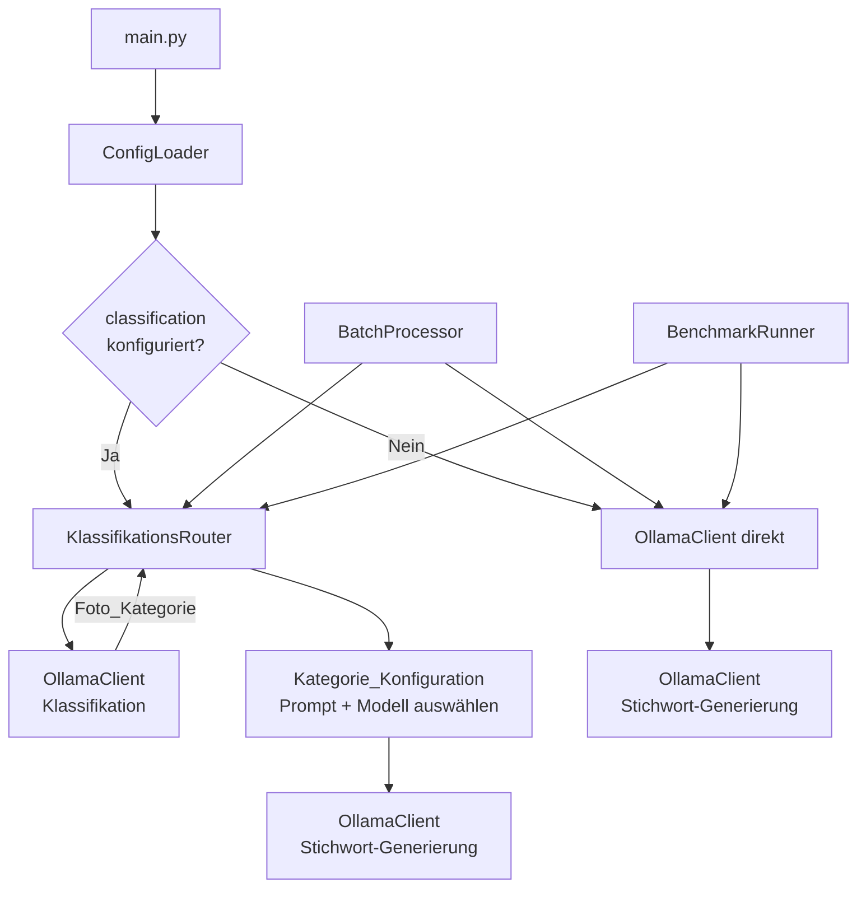
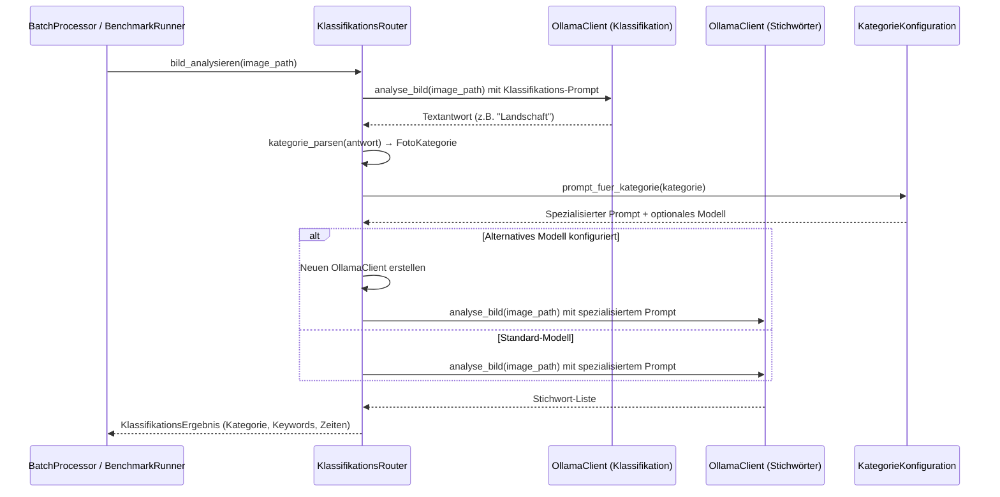
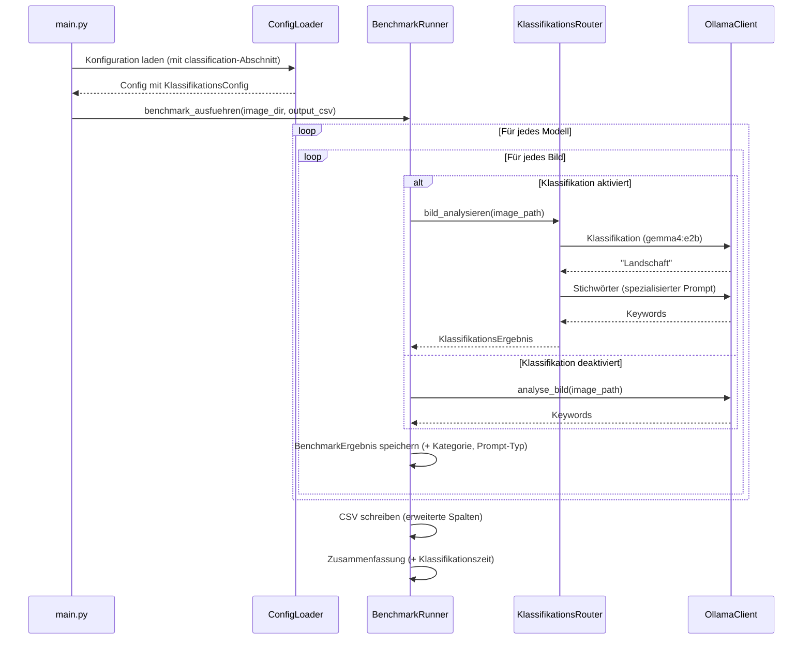

# Design-Dokument: Photo Classification Router

## Übersicht

Dieses Design beschreibt die Erweiterung des Lightroom Ollama Keyword Generators um einen Zwei-Stufen-Prozess: Zuerst klassifiziert ein schnelles Vision-Modell (z. B. `gemma4:e2b`, ~2s pro Bild) jedes Foto in eine von acht vordefinierten Kategorien (Landschaft, Porträt, Architektur, Dokument, Essen, Tiere, Garten, Sonstiges). Basierend auf dieser Klassifikation wählt ein Router den passenden spezialisierten Prompt — und optional ein alternatives Modell — für die eigentliche Stichwort-Generierung aus.

Der Schwerpunkt liegt auf der nahtlosen Integration in den bestehenden Benchmark-Modus, damit die Qualität der kategorie-spezifischen Prompts direkt mit dem bisherigen Einzelprompt-Ansatz verglichen werden kann.

### Technologie-Entscheidungen

- **Klassifikations-Modell**: `gemma4:e2b` — schnell (~2s), passt in 11 GB VRAM (GeForce RTX 2080 Ti), multimodal
- **Kommunikation**: Bestehender `OllamaClient` wird wiederverwendet — gleiche REST API (`POST /api/generate`), gleiche base64-Kodierung
- **Konfiguration**: Erweiterung der bestehenden YAML-Struktur um einen `classification`-Abschnitt — kein neues Format, kein neues Dependency
- **Kategorie-Parsing**: Einfaches String-Matching mit Normalisierung (lowercase, strip) — kein NLP-Framework nötig
- **Fallback-Strategie**: Bei jedem Fehler (Timeout, unbekannte Kategorie, API-Fehler) wird der bestehende Fallback-Prompt verwendet — keine Fotos bleiben unverarbeitet

## Architektur

Die bestehende Pipeline wird um den `KlassifikationsRouter` erweitert, der sich zwischen `BatchProcessor`/`BenchmarkRunner` und `OllamaClient` einfügt:



### Verarbeitungsablauf mit Klassifikation



### Benchmark-Ablauf mit Klassifikation



## Komponenten und Schnittstellen

### Neue Datenklassen

```python
from enum import Enum

class FotoKategorie(str, Enum):
    """Vordefinierte Foto-Kategorien für die Klassifikation."""
    LANDSCHAFT = "Landschaft"
    PORTRAET = "Porträt"
    ARCHITEKTUR = "Architektur"
    DOKUMENT = "Dokument"
    ESSEN = "Essen"
    TIERE = "Tiere"
    GARTEN = "Garten"
    SONSTIGES = "Sonstiges"


@dataclass
class KategorieConfig:
    """Konfiguration für eine einzelne Foto-Kategorie."""
    prompt: str
    modell: str | None = None  # None = Standard-Modell verwenden

@dataclass
class KlassifikationsConfig:
    """Gesamte Klassifikations-Konfiguration."""
    modell: str                                    # z.B. "gemma4:e2b"
    prompt: str                                    # Klassifikations-Prompt
    kategorien: dict[FotoKategorie, KategorieConfig]  # Pro Kategorie: Prompt + opt. Modell

@dataclass
class KlassifikationsErgebnis:
    """Ergebnis eines klassifizierten Bild-Durchlaufs."""
    kategorie: FotoKategorie
    keywords: list[str]
    klassifikations_zeit_ms: float
    keyword_zeit_ms: float
    verwendeter_prompt_typ: str   # z.B. "Landschaft", "Sonstiges", "Fallback"
    verwendetes_modell: str       # Modell für Stichwort-Generierung
```

### KlassifikationsRouter

Zentrale neue Komponente, die den Zwei-Stufen-Prozess orchestriert.

```python
class KlassifikationsRouter:
    """Orchestriert Klassifikation → spezialisierte Stichwort-Generierung."""

    def __init__(
        self,
        endpoint: str,
        klassifikations_config: KlassifikationsConfig,
        standard_modell: str,
        fallback_prompt: str,
    ) -> None:
        """
        Args:
            endpoint: Ollama API Endpunkt
            klassifikations_config: Klassifikations-Konfiguration
            standard_modell: Standard-Modell für Stichwort-Generierung
            fallback_prompt: Prompt für Kategorie "Sonstiges" oder bei Fehlern
        """
        ...

    def bild_analysieren(self, image_path: str) -> KlassifikationsErgebnis:
        """Klassifiziert ein Bild und generiert spezialisierte Stichwörter.

        1. Bild an Klassifikations-Modell senden
        2. Antwort in FotoKategorie parsen
        3. Passenden Prompt + Modell aus KategorieConfig laden
        4. Bild an Stichwort-Modell mit spezialisiertem Prompt senden
        5. KlassifikationsErgebnis zurückgeben

        Bei Fehlern in Schritt 1-3: Fallback-Prompt verwenden.
        """
        ...

    @staticmethod
    def kategorie_parsen(antwort: str) -> FotoKategorie:
        """Parst die Textantwort des Klassifikations-Modells in eine FotoKategorie.

        - Normalisiert: lowercase, strip
        - Matched gegen FotoKategorie-Werte
        - Bei keinem Match: FotoKategorie.SONSTIGES
        """
        ...

    @staticmethod
    def kategorie_formatieren(kategorie: FotoKategorie) -> str:
        """Formatiert eine FotoKategorie zurück in den normalisierten Kategorienamen."""
        return kategorie.value
```

### Erweiterter ConfigLoader

Der bestehende `ConfigLoader` wird um das Laden des `classification`-Abschnitts erweitert.

```python
# Erweitertes Config-Dataclass
@dataclass
class Config:
    # ... bestehende Felder ...
    klassifikation: KlassifikationsConfig | None = None  # None = deaktiviert

class ConfigLoader:
    def load(self, config_path: str) -> Config:
        """Lädt die Konfiguration inkl. optionalem classification-Abschnitt.

        - Wenn 'classification' vorhanden: KlassifikationsConfig erstellen
        - Wenn 'classification' fehlt: klassifikation = None (deaktiviert)
        - Validierung: Jede Kategorie MUSS einen Prompt haben
        """
        ...
```

### Erweiterter BenchmarkRunner

Der `BenchmarkRunner` wird erweitert, um den `KlassifikationsRouter` zu nutzen und erweiterte Ergebnisse zu erfassen.

```python
@dataclass
class BenchmarkErgebnis:
    model_name: str
    image_name: str
    keywords: list[str]
    response_time_ms: float
    error: str | None = None
    # Neue Felder für Klassifikation:
    foto_kategorie: str | None = None        # z.B. "Landschaft"
    prompt_typ: str | None = None             # z.B. "Landschaft", "Fallback"
    klassifikations_zeit_ms: float | None = None

class BenchmarkRunner:
    def benchmark_ausfuehren(self, image_dir: str, output_csv: str) -> list[BenchmarkZusammenfassung]:
        """Erweitert: Nutzt KlassifikationsRouter wenn classification konfiguriert.

        Neue CSV-Spalten: foto_kategorie, prompt_typ, klassifikations_zeit_ms
        Neue Zusammenfassung: Durchschnittliche Klassifikationszeit pro Modell
        """
        ...
```

### Erweiterter BatchProcessor

```python
class BatchProcessor:
    def __init__(
        self,
        ollama: OllamaClient,
        schreiber: StichwortSchreiber,
        tracker: VerarbeitungsTracker,
        model_name: str,
        model_version: str,
        klassifikations_router: KlassifikationsRouter | None = None,
    ) -> None:
        """Erweitert um optionalen KlassifikationsRouter."""
        ...

    def batch_verarbeiten(self, fotos: list[FotoEintrag]) -> BatchErgebnis:
        """Erweitert: Nutzt KlassifikationsRouter wenn vorhanden.

        Neue Konsolenausgabe pro Foto: erkannte Kategorie + verwendetes Modell
        Neue Zusammenfassung: Anzahl Fotos pro Kategorie
        """
        ...
```

## Datenmodelle

### Erweiterte YAML-Konfiguration

```yaml
# Bestehende Konfiguration
catalog_path: "C:/Users/Fotograf/Pictures/Lightroom/MeinKatalog.lrcat"
model_name: "gemma4:e4b"
ollama_endpoint: "http://localhost:11434"

prompt_template: >
  Du bist ein professioneller Foto-Analyst. Analysiere dieses Foto und liefere
  beschreibende deutsche Stichwörter. Antworte NUR mit einer kommaseparierten
  Liste von deutschen Stichwörtern.

# Neuer Abschnitt: Klassifikation und Routing
classification:
  model: "gemma4:e2b"
  prompt: >
    Klassifiziere dieses Foto in genau eine der folgenden Kategorien.
    Antworte NUR mit dem Kategorienamen, nichts anderes.
    Kategorien: Landschaft, Porträt, Architektur, Dokument, Essen, Tiere, Garten, Sonstiges
  categories:
    Landschaft:
      prompt: >
        Du bist ein Experte für Landschaftsfotografie. Analysiere dieses Foto
        und liefere deutsche Stichwörter mit Fokus auf: Wetter, Tageszeit,
        Lichtstimmung, Vegetation, Gelände, Gewässer, Jahreszeit, Horizont.
        Antworte NUR mit einer kommaseparierten Liste.
    Porträt:
      prompt: >
        Du bist ein Experte für Porträtfotografie. Analysiere dieses Foto
        und liefere deutsche Stichwörter mit Fokus auf: Personen, Anzahl,
        Gesichtsausdrücke, Kleidung, Pose, Hintergrund, Beleuchtung.
        Antworte NUR mit einer kommaseparierten Liste.
    Architektur:
      prompt: >
        Du bist ein Experte für Architekturfotografie. Analysiere dieses Foto
        und liefere deutsche Stichwörter mit Fokus auf: Gebäudetyp,
        Architekturstil, Epoche, berühmte Wahrzeichen, Material, Perspektive.
        Antworte NUR mit einer kommaseparierten Liste.
    Dokument:
      prompt: >
        Du bist ein Experte für Dokumentenanalyse. Analysiere dieses Foto
        und liefere deutsche Stichwörter mit Fokus auf: Dokumenttyp,
        Textinhalte, Sprache, Format, Zustand.
        Antworte NUR mit einer kommaseparierten Liste.
      model: "gemma4:e4b"  # Optionales alternatives Modell
    Essen:
      prompt: >
        Du bist ein Experte für Food-Fotografie. Analysiere dieses Foto
        und liefere deutsche Stichwörter mit Fokus auf: Gericht, Zutaten,
        Küche, Präsentation, Anlass, Getränke.
        Antworte NUR mit einer kommaseparierten Liste.
    Tiere:
      prompt: >
        Du bist ein Experte für Tierfotografie. Analysiere dieses Foto
        und liefere deutsche Stichwörter mit Fokus auf: Tierart, Rasse,
        Lebensraum, Verhalten, Anzahl, Umgebung.
        Antworte NUR mit einer kommaseparierten Liste.
    Garten:
      prompt: >
        Du bist ein Experte für Gartenfotografie. Analysiere dieses Foto
        und liefere deutsche Stichwörter mit Fokus auf: Pflanzenarten, Blüten,
        Gartengestaltung, Jahreszeit, Gartenelemente, Farben.
        Antworte NUR mit einer kommaseparierten Liste.
    Sonstiges:
      prompt: >
        Du bist ein professioneller Foto-Analyst. Analysiere dieses Foto und
        liefere beschreibende deutsche Stichwörter für die Foto-Katalogisierung.
        Antworte NUR mit einer kommaseparierten Liste von deutschen Stichwörtern.
```

### FotoKategorie Enum

```python
class FotoKategorie(str, Enum):
    LANDSCHAFT = "Landschaft"
    PORTRAET = "Porträt"
    ARCHITEKTUR = "Architektur"
    DOKUMENT = "Dokument"
    ESSEN = "Essen"
    TIERE = "Tiere"
    GARTEN = "Garten"
    SONSTIGES = "Sonstiges"
```

Die Verwendung von `str, Enum` ermöglicht direkten String-Vergleich und einfache Serialisierung. Die Normalisierung beim Parsen erfolgt über ein Lookup-Dictionary:

```python
_KATEGORIE_LOOKUP: dict[str, FotoKategorie] = {
    k.value.lower(): k for k in FotoKategorie
}
# Ergibt: {"landschaft": LANDSCHAFT, "porträt": PORTRAET, ...}
```

### Erweiterte CSV-Ausgabe (Benchmark)

```csv
# prompt: Du bist ein professioneller Foto-Analyst...
model,image,keywords,response_time_ms,foto_kategorie,prompt_typ,klassifikations_zeit_ms
gemma4:e4b,sunset.jpg,Sonnenuntergang;Meer;Horizont;Abendrot,3200,Landschaft,Landschaft,1850
gemma4:e4b,portrait.jpg,Frau;Lächeln;Studio;Beleuchtung,2800,Porträt,Porträt,1920
gemma4:e4b,receipt.jpg,Rechnung;Text;Papier;Datum,3500,Dokument,Dokument,1750
```

Neue Spalten:
- `foto_kategorie`: Die vom Klassifikations-Modell erkannte Kategorie
- `prompt_typ`: Der tatsächlich verwendete Prompt-Typ (kann "Fallback" sein bei Fehlern)
- `klassifikations_zeit_ms`: Zeit für die Klassifikation in Millisekunden

### Erweiterte Fehlerklasse

```python
class KlassifikationsError(KeywordGeneratorError):
    """Fehler bei der Foto-Klassifikation."""
```

Diese Fehlerklasse wird intern im `KlassifikationsRouter` verwendet und nie nach außen propagiert — der Router fängt sie ab und fällt auf den Fallback-Prompt zurück.


## Correctness Properties

*Eine Property ist eine Eigenschaft oder ein Verhalten, das über alle gültigen Ausführungen eines Systems hinweg gelten sollte — im Wesentlichen eine formale Aussage darüber, was das System tun soll. Properties bilden die Brücke zwischen menschenlesbaren Spezifikationen und maschinenverifizierbaren Korrektheitsgarantien.*

### Property 1: Kategorie-Parsing — Normalisierung und Fallback

*Für alle* Strings gilt: `kategorie_parsen` gibt immer ein gültiges `FotoKategorie`-Mitglied zurück. *Für alle* Strings, die eine Groß-/Kleinschreibungs- oder Whitespace-Variation eines bekannten Kategorienamens sind, gibt `kategorie_parsen` die korrekte `FotoKategorie` zurück. *Für alle* Strings, die keinem bekannten Kategorienamen entsprechen, gibt `kategorie_parsen` `FotoKategorie.SONSTIGES` zurück.

**Validates: Requirements 1.2, 5.2, 8.1, 8.3, 8.4**

### Property 2: Kategorie Round-Trip — Parsen → Formatieren → Parsen

*Für alle* gültigen `FotoKategorie`-Werte gilt: `kategorie_parsen(kategorie_formatieren(kategorie))` ergibt dieselbe `FotoKategorie` wie die Eingabe.

**Validates: Requirements 8.2**

### Property 3: Prompt- und Modellauswahl nach Kategorie

*Für alle* `FotoKategorie`-Werte und *für alle* gültigen `KategorieConfig`-Mappings gilt: Der `KlassifikationsRouter` wählt den Prompt aus der `KategorieConfig` der erkannten Kategorie. Wenn die `KategorieConfig` ein alternatives Modell definiert, wird dieses verwendet; andernfalls wird das Standard-Modell verwendet.

**Validates: Requirements 2.1, 3.1, 3.2**

### Property 4: Klassifikations-Konfigurations-Round-Trip

*Für alle* gültigen `KlassifikationsConfig`-Objekte (mit Modellname, Klassifikations-Prompt und Kategorie-Definitionen mit jeweils einem Prompt und optionalem Modell) gilt: Das Serialisieren als YAML und anschließende Laden über den `ConfigLoader` ergibt eine äquivalente `KlassifikationsConfig`, bei der Modellname, Klassifikations-Prompt und alle Kategorie-Prompts und -Modelle identisch sind.

**Validates: Requirements 4.1, 4.2, 4.5**

### Property 5: Validierung fehlender Kategorie-Prompts

*Für alle* Klassifikations-Konfigurationen, bei denen mindestens eine Kategorie keinen Prompt definiert, soll der `ConfigLoader` einen `ConfigError` auslösen.

**Validates: Requirements 4.4**

### Property 6: Erweiterte Benchmark-CSV Round-Trip

*Für alle* Listen von `BenchmarkErgebnis`-Objekten (mit gültigen Modellnamen, Bildnamen, Keyword-Listen, Antwortzeiten und optionalen Klassifikationsfeldern: `foto_kategorie`, `prompt_typ`, `klassifikations_zeit_ms`) gilt: Das Schreiben als CSV und anschließende Einlesen ergibt eine äquivalente Liste, bei der für jeden Eintrag alle Felder — einschließlich der neuen Klassifikationsspalten — übereinstimmen.

**Validates: Requirements 7.2**

### Property 7: Benchmark-Zusammenfassung mit Klassifikationszeit

*Für alle* Listen von `BenchmarkErgebnis`-Objekten mit Klassifikationszeiten gilt: Die berechnete Zusammenfassung pro Modell enthält eine `durchschnitt_klassifikations_ms`, die dem arithmetischen Mittel der `klassifikations_zeit_ms`-Werte der erfolgreich verarbeiteten Bilder dieses Modells entspricht.

**Validates: Requirements 7.3**

## Fehlerbehandlung

### Fehlerbehandlungsstrategie

Der `KlassifikationsRouter` folgt dem Prinzip "kein Foto bleibt unverarbeitet". Alle Klassifikationsfehler werden intern abgefangen und führen zum Fallback-Prompt:

| Fehlertyp | Verhalten | Anforderung |
|-----------|-----------|-------------|
| Klassifikations-Modell gibt Fehler zurück | Fallback-Prompt verwenden, Fehler loggen | 5.1 |
| Unbekannte Kategorie in Antwort | Kategorie "Sonstiges" zuweisen, Fallback-Prompt | 5.2 |
| Klassifikations-Timeout (>10s) | Timeout loggen, Fallback-Prompt verwenden | 5.3 |
| Klassifikationsfehler allgemein | Foto-Pfad + Fehlerdetails loggen | 5.4 |
| `classification`-Abschnitt fehlt in YAML | Klassifikation deaktiviert, Einzelprompt-Modus | 4.3 |
| Kategorie ohne Prompt in YAML | `ConfigError` beim Laden | 4.4 |

### Fehlerprotokollierung bei Klassifikation

Jeder Klassifikationsfehler wird mit folgenden Informationen protokolliert:
- **Foto-Pfad**: Vollständiger Pfad zum betroffenen Bild
- **Fehlertyp**: `KlassifikationsError`, `OllamaConnectionError`, `OllamaApiError`, oder `TimeoutError`
- **Fehlerdetails**: Fehlermeldung des zugrundeliegenden Fehlers
- **Fallback-Aktion**: "Verwende Fallback-Prompt" wird protokolliert

### Graceful Degradation

```python
# Pseudocode für die Fehlerbehandlung im KlassifikationsRouter
try:
    kategorie = self._klassifizieren(image_path)
    prompt, modell = self._prompt_und_modell_fuer(kategorie)
except Exception as exc:
    logger.warning("Klassifikation fehlgeschlagen für %s: %s — verwende Fallback", image_path, exc)
    kategorie = FotoKategorie.SONSTIGES
    prompt = self._fallback_prompt
    modell = self._standard_modell
```

## Teststrategie

### Dualer Testansatz

Die Teststrategie kombiniert Property-basierte Tests und Unit-Tests. Der Fokus liegt auf der Testbarkeit des Klassifikations-Parsings, der Konfigurationsvalidierung und der Benchmark-Integration.

#### Property-basierte Tests (pytest + Hypothesis)

- **Bibliothek**: [Hypothesis](https://hypothesis.readthedocs.io/) für Python
- **Mindestens 100 Iterationen** pro Property-Test
- **Jeder Test referenziert** die zugehörige Design-Property
- **Tag-Format**: `Feature: photo-classification-router, Property {nummer}: {text}`

| Property | Komponente | Was wird getestet |
|----------|-----------|-------------------|
| Property 1 | KlassifikationsRouter | Kategorie-Parsing: Normalisierung, Fallback auf SONSTIGES |
| Property 2 | KlassifikationsRouter | Round-Trip: parsen → formatieren → parsen |
| Property 3 | KlassifikationsRouter | Korrekte Prompt- und Modellauswahl nach Kategorie |
| Property 4 | ConfigLoader | Klassifikations-Konfigurations-Round-Trip (YAML ↔ Objekt) |
| Property 5 | ConfigLoader | Validierungsfehler bei fehlenden Kategorie-Prompts |
| Property 6 | BenchmarkRunner | Erweiterte CSV Round-Trip mit Klassifikationsspalten |
| Property 7 | BenchmarkRunner | Zusammenfassung: Durchschnittliche Klassifikationszeit |

#### Unit-Tests (pytest)

| Test | Komponente | Was wird getestet | Anforderung |
|------|-----------|-------------------|-------------|
| Klassifikation vor Stichwörtern | KlassifikationsRouter | Orchestrierung: Klassifikation wird zuerst aufgerufen | 1.1 |
| KlassifikationsErgebnis-Felder | KlassifikationsRouter | Ergebnis enthält Kategorie, Zeiten, Prompt-Typ | 1.3 |
| Fallback bei API-Fehler | KlassifikationsRouter | Fallback-Prompt bei OllamaApiError | 5.1 |
| Fallback bei Timeout | KlassifikationsRouter | Fallback-Prompt bei Timeout (10s) | 5.3 |
| Fehler-Logging | KlassifikationsRouter | Log enthält Foto-Pfad und Fehlerdetails | 5.4 |
| Classification fehlt → deaktiviert | ConfigLoader | Config ohne classification → klassifikation=None | 4.3 |
| Dokument mit OCR-Modell | ConfigLoader | Kategorie Dokument mit alternativem Modell ladbar | 3.3 |
| Sonstiges → Fallback-Prompt | KlassifikationsRouter | Kategorie Sonstiges verwendet Fallback-Prompt | 2.9 |
| BatchProcessor mit Router | BatchProcessor | Delegiert an KlassifikationsRouter wenn vorhanden | 6.1 |
| Konsole: Kategorie pro Foto | BatchProcessor | Ausgabe enthält Kategorie und Modell pro Foto | 6.2 |
| Zusammenfassung: Fotos pro Kategorie | BatchProcessor | Zusammenfassung enthält Kategorie-Statistik | 6.3 |
| Benchmark: Kategorie in Ergebnis | BenchmarkRunner | BenchmarkErgebnis enthält foto_kategorie und prompt_typ | 7.1 |

#### Integrationstests

| Test | Was wird getestet |
|------|-------------------|
| Klassifikation + Stichwörter End-to-End | Vollständiger Zwei-Stufen-Prozess mit Mock-Ollama |
| Benchmark mit Klassifikation | Benchmark-Durchlauf mit aktivierter Klassifikation, CSV-Validierung |
| Benchmark ohne Klassifikation | Rückwärtskompatibilität: Benchmark ohne classification-Abschnitt |

### Testinfrastruktur

- **Mock-Ollama-Responses**: Vordefinierte Klassifikations-Antworten (z.B. "Landschaft", "Porträt") und Stichwort-Antworten
- **Hypothesis-Strategien**: Custom Strategies für `FotoKategorie`, `KategorieConfig`, `KlassifikationsConfig`, `BenchmarkErgebnis` mit Klassifikationsfeldern
- **Temporäre YAML-Dateien**: `pytest tmp_path` für Konfigurations-Round-Trip-Tests
- **Temporäre CSV-Dateien**: `pytest tmp_path` für Benchmark-CSV-Round-Trip-Tests
